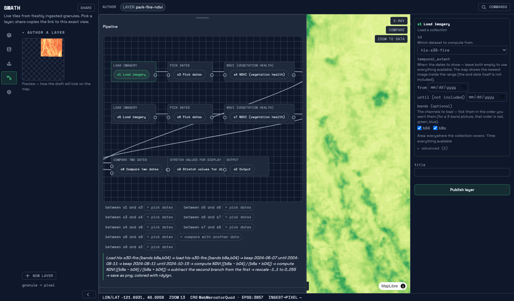

# Swath

[](https://github.com/forgo/swath/actions/workflows/ci.yml) [](https://codecov.io/gh/forgo/swath) [](https://scorecard.dev/viewer/?uri=github.com/forgo/swath)

**Satellite data comes in and is immediately live on a map — and anyone can derive a new
product from that live flow and publish it the same way, from one screen.**


*The loop: ingest → catalog → serve, one pane of glass, derive-and-publish back into the same
serve path, and a glass box beside every tile. Nothing pre-baked.*

Point Swath at where your granules land and they show up as tile layers — cataloged, served
over OGC API - Tiles and plain XYZ, viewable in the built-in map or in QGIS — with no
per-scene work. From that map, pick bands and build a product as a standard openEO graph: an
index, a formula, a date-vs-date change layer, or your own code running sandboxed; publish it
and it serves live beside the built-in layers, with a share link that reproduces the exact
view. Every tile carries the server's own account of how it was made — cache, overview, or
live render; the granules read; bytes; timings — and that account is what the x-ray overlay
shows and what the test suite asserts on.

Built for teams running Earth-observation data services — agencies, contractors, and anyone
already gluing STAC, COGs, and a tiler together by hand — who want the whole loop in one
deployable, standards-native binary.

## Try it

```sh
docker run -p 8080:8080 ghcr.io/forgo/swath serve --fixtures
```

Then open <http://localhost:8080> — the committed HLS fixtures and the embedded viewer. Every
published image passed this exact command in CI before pushing
([smoke test](.github/scripts/smoke-image.sh): `/healthz`, a rendered tile, the viewer).


*NDVI computed live from the fixture bands on every uncached tile — nothing pre-baked. Every
screenshot in [`docs/media/screenshots/`](docs/media/screenshots/index.md) is captured from
the fixture stack and diff-verified on re-capture.*

More ways in — the full ingest-to-pixel demo from a checkout, and authoring your first layer
from the UI, each verified end-to-end in a fresh environment:
[`docs/QUICKSTART.md`](docs/QUICKSTART.md).

## See the machine work

Processing standards such as openEO can define a derived product, but hand it back as a batch
job; dynamic tile servers render fast, but only what the operator deployed. Swath does both — a
standard openEO graph in, live measured tiles out. The graph may carry your own code: `run_udf`
runs as sandboxed, fuel-metered WebAssembly inside the tile path, and a runaway module is
refused without touching its neighbours ([`docs/PERFORMANCE.md`](docs/PERFORMANCE.md) §9).
How that compares, cell by cell and cited: [`docs/COMPARISON.md`](docs/COMPARISON.md).


*Click any tile in the x-ray: the planner's candidate table — what it chose, what it rejected,
and why.*



*Change detection authored on the canvas: two dated branches of one collection joined by a
subtract, previewed before publishing.*

## What it is

Swath is an open-source geospatial tile platform with a pure-Rust serving core. It ingests
Earth-observation granules (COG and, via virtual references, archival HDF5), catalogs them,
and serves them as dynamic tiles through OGC API - Tiles and XYZ. A cost-aware planner decides
per tile between cache, overview, and live render under operator budget knobs, and every
decision is published as a trace — the x-ray overlay in the viewer and the integration-test
assertion surface are the same data.

Swath's serving path composes no external tiler. TiTiler, rio-tiler, GDAL, and morecantile
relate to Swath as validation oracles: the test suite renders the same tiles and tile-matrix
math through them and pixel-diffs the results against committed goldens
([`tests/oracle/`](tests/oracle/), `just oracle-verify`; the history of this decision is in
[`docs/CHARTER.md`](docs/CHARTER.md) §8 and [`docs/COMPARISON.md`](docs/COMPARISON.md)).

## Measured, not promised

Method, environment, and regeneration recipes for every figure:
[`docs/PERFORMANCE.md`](docs/PERFORMANCE.md).

- **Ingest-to-pixel: <!-- number:i2p-ms -->646 ms<!-- /number:i2p-ms -->** — from "a new granule lands" to "a correct, pixel-verified tile
  on the map," through the real stack. The north-star metric
  ([`docs/REQUIREMENTS.md`](docs/REQUIREMENTS.md) §3), enforced under a 10 s budget by
  `just e2e` on every commit ([`docs/PERFORMANCE.md`](docs/PERFORMANCE.md) §4, artifact:
  [`docs/perf/i2p-baseline.json`](docs/perf/i2p-baseline.json)).
- **Hot-tile serving: p50 <!-- number:hot-p50-approx -->~23 ms<!-- /number:hot-p50-approx -->** at 32-way concurrency from the write-through cache; cold
  live renders of never-seen z15 tiles land at p50 <!-- number:cold-p50-approx -->~660 ms<!-- /number:cold-p50-approx -->
  ([`docs/PERFORMANCE.md`](docs/PERFORMANCE.md) §6, artifact:
  [`docs/perf/load-baseline.md`](docs/perf/load-baseline.md)).
- **Referencer: <!-- number:ref-warm-ms -->13.8 ms<!-- /number:ref-warm-ms --> warm** to generate the virtual-reference manifest for a 1,551-chunk
  VIIRS HDF-EOS5 granule — **<!-- number:ref-ratio -->39.5×<!-- /number:ref-ratio -->** faster than the VirtualiZarr sidecar it replaced, which
  remains the conformance reference ([`docs/PERFORMANCE.md`](docs/PERFORMANCE.md) §7,
  artifact: [`docs/perf/referencer-baseline.json`](docs/perf/referencer-baseline.json)).
- **Head-to-head with TiTiler, honestly:** on the stateless render-vs-render scenarios —
  TiTiler's specialty — TiTiler is faster on the test machine; Swath's leads are the hot-tile
  path (its write-through cache) and control-plane latency. Full pre-committed protocol and
  results: [`docs/perf/load-h2h-titiler.md`](docs/perf/load-h2h-titiler.md).

## Status

**Alpha.** `v0.1.0-alpha.1` is published as a GitHub prerelease with a versioned container
image. Alphas ship with full build rigor and zero stability promises — anything may break
between alphas, and there is no support commitment until the graduation checklist in
[`docs/RELEASING.md`](docs/RELEASING.md) is met.

What is shipped, with its evidence; what is deliberately parked (the canonical deferral
inventory — tile-cache GC, overview generation, a learned planner cost model, and more); and
what is next, all live in [`docs/ROADMAP.md`](docs/ROADMAP.md).

## Documentation

Newcomer-first reading order — start where you'll actually start (running it), then go deeper:

1. [`docs/QUICKSTART.md`](docs/QUICKSTART.md) — three verified tracks from nothing to tiles;
   [`docs/DEMO.md`](docs/DEMO.md) — the stopwatch demo and what the x-ray overlay shows.
2. [`docs/OPERATIONS.md`](docs/OPERATIONS.md) — the operator guide: store backends, the tile
   cache, ingest sources, observability — with [`docs/CONFIG.md`](docs/CONFIG.md) (every
   flag/env/TOML key, kept in sync by a CI-enforced drift test) and
   [`docs/ENDPOINTS.md`](docs/ENDPOINTS.md) (every mounted route, with captured examples).
3. [`docs/EXTENDING.md`](docs/EXTENDING.md) — the ports: adding a source adapter or an
   openEO process, and the oracle and test obligations that come with each.
4. [`docs/PERFORMANCE.md`](docs/PERFORMANCE.md) and [`docs/COMPARISON.md`](docs/COMPARISON.md)
   — the evidence behind every number and positioning claim in this README.

The maintainer canon — why Swath is shaped this way:

5. [`docs/REQUIREMENTS.md`](docs/REQUIREMENTS.md) — the north star: mission, non-negotiable
   requirements (R1-R10), success criteria. Changes rarely and deliberately.
6. [`docs/CHARTER.md`](docs/CHARTER.md) — the full vision: why now, the wedge, pillars,
   delivery phases.
7. [`docs/ARCHITECTURE.md`](docs/ARCHITECTURE.md) — ports & adapters, the build/adopt/bind
   boundary, component model, data flows.
8. [`docs/ENGINEERING.md`](docs/ENGINEERING.md) — repo standards: toolchains, linting,
   testing, CI/CD, release, security posture.
9. [`docs/decisions/`](docs/decisions/) — dated, immutable ADRs; [`prototypes/`](prototypes/)
   holds the dated experiments that produced the evidence.

## License

Apache-2.0 (see [`LICENSE`](LICENSE) and [`NOTICE`](NOTICE)) — chosen for its explicit patent
grant (ADR 0003). Contributions require DCO sign-off.
