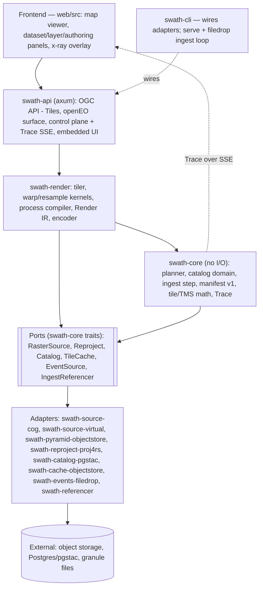

# Swath — Architecture

_Working document. Draft v0.3 — August 2026. §§4, 6, 7 and 12 describe the code as built and
carry a "last verified against sources" fingerprint — a content hash of the section's referenced
source files, checked by the docs gate (`crates/swath-cli/src/docs_check/stamps.rs`); it survives
squash-merges, and when a referenced source changes the gate prints the new fingerprint to paste
after re-verifying. The remaining sections are design intent. Where any doc disagrees with an
ADR, the ADR wins. Engineering standards live in `ENGINEERING.md`._

---

## 1. Purpose

Pin the shape of Swath: the **build vs adopt/bind** boundary, the **ports** the core depends on,
the **adapters** behind them, the **standards** we expose, and the **data flows** that produce
the north-star metric (ingest-to-pixel latency).

## 2. Design principles (locked)

**Hexagonal / ports-and-adapters** (a small core over narrow port traits; churn is absorbed at
adapters). **Standards as interface contracts** (STAC, the OGC API family, the openEO graph — the
anti-lock-in mechanism). **Pure-Rust core, single static binary** (adopt Rust reader/codec
crates; bind projection math; never reimplement PROJ or format drivers). **Glass-box by
construction** (every render emits a decision **Trace** that powers the x-ray UI _and_ is the
test oracle). **Intuitive out of the box; resilient to extension** (one command, sane defaults;
extensions plug in at the ports). **Priorities, in order:** correctness → performance/memory →
UX → safety → docs → standards breadth.

## 3. The build / adopt / bind / never boundary

| Layer | Decision | Concretely |
| --- | --- | --- |
| Tiler brain, planner, catalog/ingest orchestration, trace model, process compiler + Render IR | **BUILD** | `swath-render`, `swath-core` |
| COG / Zarr / virtual-reference reading | **ADOPT** | `async-geotiff`/`async-tiff`, `zarrs`, `object_store` |
| Image encoding, HTTP, async runtime, vector/columnar | **ADOPT** | `image`/`png`/`webp`, `axum`, `tokio`, `geoarrow-rs` |
| Projection / datum math | **BIND** (prefer pure-Rust) | `proj4rs`; `proj` C-bindings feature-gated for the long tail |
| Legacy virtual-reference _generation_ | **ADOPT (Python, ingest-time only)** | `VirtualiZarr`/`kerchunk` as an ingest sidecar; Rust reads the manifest at serve time |
| Projection/datum catalog, universal format drivers, general GDAL warp | **NEVER reimplement** | (GDAL/rio-tiler live only in the test suite as a correctness oracle) |

## 4. Component model

Every node below names a real crate or module (crate in the subgraph title, module or component in
parentheses on the node). Nothing here is aspirational: deferred surfaces (Maps, Records, Processes,
EDR, Features, embeddings) appear only in the §7 phase tables and in the standards map
([`docs/media/standards-map.svg`](media/standards-map.svg), evidence ledger in
[`standards-map.notes.md`](media/standards-map.notes.md)).



All nodes are implemented, and every name is a real crate or module (the per-module component
detail lives in each crate's rustdoc). The Python `VirtualiZarr` sidecar is deliberately absent:
it is the conformance *reference* for `swath-referencer` (ADR 0006), not a runtime component.

_Last verified against sources `1b3ad18f21ea`._

## 5. The Core (pure logic)

The **tiler engine** produces an encoded tile + a `Trace`; the **materialization planner**
chooses `CacheHit | Overview | Live` per `(layer, tile/zoom)` under a per-layer **Budget**,
reasoning into the Trace; the **process compiler** lowers the openEO subset into a typed
`RenderPlan` (the graph is _interchange_, the IR is _ours_); the **catalog service** is the
"make STAC disappear" domain; the **ingest orchestrator** reacts to `EventSource`, registers
assets or triggers legacy virtualization, upserts the catalog, and owns the ingest-to-pixel
timer; the **Trace model** (§9) rides with every render.

## 6. Ports — trait signatures

The signatures below are from the named files (doc comments and method bodies elided; the
`Catalog` block abbreviates its return types); the rustdoc on each trait and its module is the
normative contract — including the design points that superseded the v0.1 sketches (the
domain-shaped `Catalog` per [`docs/design/catalog-domain.md`](design/catalog-domain.md), §16.5;
the pull-shaped `EventSource`; no `ProcessRegistry` port, ADR 0010; `IngestReferencer`,
ADR 0006).

```rust
// crates/swath-core/src/source.rs
pub trait RasterSource: Send + Sync {
    fn describe(
        &self,
        asset: &AssetRef,
    ) -> impl Future<Output = Result<RasterInfo, SourceError>> + Send;

    fn read_window(
        &self,
        asset: &AssetRef,
        window: WindowRequest,
        band: BandSelection,
        level: ReadLevel,
    ) -> impl Future<Output = Result<WindowData, SourceError>> + Send;
}

// crates/swath-core/src/reproject.rs
pub trait CoordTransform: Send + Sync {
    fn transform(&self, x: f64, y: f64) -> Result<(f64, f64), ReprojectError>;

    fn transform_slice(&self, points: &mut [(f64, f64)]) -> Result<(), ReprojectError> { /* default: per-point loop */ }
}

pub trait Reproject: Send + Sync {
    fn transformer(&self, from: &Crs, to: &Crs) -> Result<Box<dyn CoordTransform>, ReprojectError>;
}

// crates/swath-core/src/catalog.rs — five async methods of the same
// shape as read_window above (impl Future … + Send), domain-typed:
pub trait Catalog: Send + Sync {
    fn upsert_dataset(&self, dataset: &Dataset) -> …;
    fn upsert_granules(&self, granules: &[Granule]) -> …;
    fn get_dataset(&self, id: &DatasetId) -> …;
    fn list_datasets(&self) -> …;
    fn find_granules(&self, dataset: &DatasetId, query: &GranuleQuery) -> …;
}

// crates/swath-core/src/cache.rs — no TTL by design: content-derived keys
// never go stale (§10, §16.3)
pub trait TileCache: Send + Sync {
    fn get(
        &self,
        key: &TileKey,
    ) -> impl Future<Output = Result<Option<CachedTile>, CacheError>> + Send;

    fn put(
        &self,
        key: &TileKey,
        bytes: &[u8],
        content_type: &str,
    ) -> impl Future<Output = Result<(), CacheError>> + Send;
}

// crates/swath-core/src/events.rs
pub trait EventSource: Send {
    fn next_event(
        &mut self,
    ) -> impl Future<Output = Result<Option<GranuleEvent>, EventError>> + Send;
}

// crates/swath-core/src/ingest.rs
pub trait IngestReferencer: Send + Sync {
    fn handles(&self, granule: &Path) -> bool;

    fn generate(&self, granule: &Path) -> Result<VirtualManifest, ReferencerError>;
}
```

The core entry points (not ports — the logic itself; same files are normative, and the stamp
below fingerprints them too): `plan(budget, availability) -> Plan` in
`crates/swath-core/src/planner.rs` (`PlanChoice` is
`CacheHit | Overview { factor } | Live | Refuse { .. }`, `#[non_exhaustive]`);
`compile(graph, ctx) -> Result<CompiledProduct, CompileError>` in
`crates/swath-render/src/process.rs`; and `render_tile` / `render_tile_cached` in
`crates/swath-render/src/tiler.rs` — free functions generic over the ports, not a `Tiler`
struct; the cached variant owns the probe + write-through.

_Last verified against sources `1bb2d692dd3a`._

## 7. Adapters and inbound APIs

**Adapters (outbound, behind ports):**

| Port | Implemented adapter (crate) | Planned adapters |
| --- | --- | --- |
| `RasterSource` | `swath-source-cog`; `swath-source-virtual`; `swath-pyramid-objectstore` (materialized-pyramid overlay over either) | `zarrs` (native Zarr stores) |
| `Reproject` | `swath-reproject-proj4rs` (pure Rust) | `proj` C-bindings (geostationary/exotic) |
| `Catalog` | `swath-catalog-pgstac` (Postgres + pgstac) | — |
| `TileCache` | `swath-cache-objectstore` (local/S3) | Redis hot-tile cache |
| `EventSource` | `swath-events-filedrop` (watched drop directory) | S3 notifications, CMR polling |
| `IngestReferencer` | `swath-referencer` (pure Rust: HDF-EOS, GRIB2; Python `VirtualiZarr` sidecar as conformance reference, ADR 0006) | HDF5/NetCDF4 breadth |
| `EmbeddingModel`/`VectorIndex` | — (frontier; no port trait defined yet) | Clay/Prithvi/AlphaEarth + vector index |

There is no `ProcessRegistry` port (§6): the openEO subset is compiled in-core against a
`CompileContext` (ADR 0010); an external OGC Processes backend remains a possible later seam.

**Inbound APIs (standards), by phase** (status per the standards map,
[`docs/media/standards-map.svg`](media/standards-map.svg) /
[`standards-map.notes.md`](media/standards-map.notes.md)):

| API | Target phase | Status |
| --- | --- | --- |
| OGC API - Tiles | 1 | implemented (core, tileset, tilesets-list, dataset-tilesets, png) |
| Control-plane REST + Trace SSE | 1 | implemented |
| openEO (bounded authoring profile, ADR 0010; preview `POST /result`, ADR 0014) | 1 | implemented |
| OGC API - Maps | deferred | not implemented — the standards map records the final call |
| OGC API - Records | 2 | not started |
| OGC API - Processes | 2 | not started (authoring is openEO-only, ADR 0010) |
| OGC API - EDR | 3 | not started |
| OGC API - Features | 3 | not started |

_Last verified against sources `2fb686d18506`._

## 8. Data flows

**Tile-serve hot path:** request → resolve layer + RenderSpec → planner chooses
`CacheHit | Overview | Live` → (on a render) `RasterSource` window read → reproject/resample →
Render IR (band math → composite → colormap) → encode → write-through cache → encoded tile +
Trace.

**Ingest-to-pixel (north star):** granule event → ingest orchestrator → register the asset
directly (clean COG/Zarr) or generate a virtual manifest first (legacy NetCDF/HDF) → catalog
upsert (pgstac) → layer servable; the granule event also starts the ingest-to-pixel timer.

**Data-scientist publish** is the same serve path: an authored openEO graph compiles to Render
IR, registers a derived layer, and the planner decides its materialization per tile.

## 9. Trace / observability model (the x-ray keystone)

Every `render_tile` returns a `Trace` and streams it over SSE: the decision
(`Live | Overview{level} | CacheHit`), source, CRS hop, bytes read, the chunks or byte-ranges
touched, per-stage timings, the cache key, and `ingest_to_pixel_ms` when known. The overlay
paints from it; the test suite asserts against the same struct — observability and correctness
are one surface.

## 10. Materialization & cache model

**Cache key** = hash of `(layer_version, render_spec, tile_coord, tms)`; a `layer_version` bump
invalidates cleanly. **Overview store** (shipped, #183): per-asset GeoZarr-shaped pyramids
produced by `swath materialize` — batch, idempotent, resumable
(`crates/adapters/swath-pyramid-objectstore`); the `PyramidSource` overlay merges materialized
factors into `describe`, so the planner prefers an overview at low zoom with no planner change.
**Budget**: per-layer policy trading storage vs latency; the planner's cost estimate
(bytes × warp cost) vs availability decides `Live | Overview | CacheHit`. Every choice is
traced.

## 11. Runtime & concurrency

`tokio` + `axum`. Async I/O via `object_store`; CPU-bound warp/resample runs **inline on the
async runtime** ([ADR 0012](decisions/0012-render-stays-inline-async.md)). Cancellation
propagates from dropped requests down to in-flight reads. Single process; horizontal scale by
running N stateless instances behind a load balancer.

## 12. Crate / repo layout (as built)

The Cargo workspace is exactly the §4 component model on disk: `crates/` holds `swath-core`,
`swath-render`, `swath-api`, `swath-cli`, `swath-referencer`, the e2e harness (`swath-e2e`), and
the never-shipped test crates (`swath-testkit`, `swath-testsupport`), with the seven `RasterSource`
/`Reproject`/`Catalog`/`TileCache`/`EventSource` adapter crates under `crates/adapters/`. Beside
the workspace: `web/` (the frontend, ADR 0011), `python/` (uv workspace: the VirtualiZarr
conformance sidecar), `tests/` (e2e stack, oracle + referencer-equivalence fixtures, load),
`prototypes/` (dated experiments, immutable once concluded), and `docs/`.

Phase-1 adapters are direct dependencies of the binary (Cargo features gate the embedded UI bundle
and HDF5 support, not adapter selection). See §14 for third-party extension beyond compile time.

_Last verified against sources `1b3ad18f21ea`._

## 13. Frontend architecture

Vanilla Web Components, TypeScript, no framework (ADR 0005); **MapLibre GL** is the single
necessary dependency. The x-ray overlay is fed by the Trace SSE stream. Deck.gl stays out until
a genuine GPU-scale visualization need lands (ADR 0005's revisit condition).

## 14. Extension model (decided — ADR 0013)

**Compile-time Cargo features/crates for adapters, plus openEO process graphs at runtime** as the
primary user-facing extension surface —
[ADR 0013](decisions/0013-extension-features-plus-openeo-graphs.md) records the candidate
mechanisms weighed, the WASM/RPC deferral, and the reopen condition.

## 15. Deployment topology

Single binary `swath` + **Postgres (pgstac)** + an **object store** as the only required infra.
Local: `docker compose up`. Cloud: N stateless replicas + managed Postgres + bucket.

## 16. Open questions — status ledger

Each row links the artifact that owns the full rationale; this section is a ledger, not the
argument. ADRs are immutable — a Resolved/Closed item reopens only via a superseding ADR.

| # | Item | Status | Rationale lives at |
| --- | --- | --- | --- |
| 1 | Port granularity: one `RasterSource`, or split? | Resolved | As-built port set, §6 (#152): one port; the cube half returns with a native `zarrs` adapter (§7) — reopen trigger in [`ROADMAP.md`](ROADMAP.md) |
| 2 | Where warp lives: pure kernels, or a `Warp` offload port? | Resolved | As built, §6 (#152): kernels in `swath-render`, no port; load evidence in [ADR 0012](decisions/0012-render-stays-inline-async.md); GPU/GDAL offload is an ADR-governed deferral in [`ROADMAP.md`](ROADMAP.md) |
| 3 | Cache key & invalidation | Open (narrowed by #36) | `swath-core` `cache` module docs: content-derived `layer_version` decided for v1; GC and partial-mosaic invalidation tracked in [`ROADMAP.md`](ROADMAP.md)'s inventory |
| 4 | Planner budget semantics | Resolved | [`docs/design/materialization-planner.md`](design/materialization-planner.md) (#37); its recorded future work is tracked in [`ROADMAP.md`](ROADMAP.md) |
| 5 | Control-plane domain model ("make STAC disappear") | Resolved | [`docs/design/catalog-domain.md`](design/catalog-domain.md): lossless domain↔STAC mapping |
| 6 | Extension mechanism (§14) | Closed-by-ADR | [ADR 0013](decisions/0013-extension-features-plus-openeo-graphs.md) |
| 7 | Async vs blocking render boundary | Resolved | [ADR 0012](decisions/0012-render-stays-inline-async.md) (M4 load evidence; reopen trigger recorded there) |
| 8 | The Python ingest seam | Resolved | [ADR 0006](decisions/0006-legacy-referencer-staged.md): staged Python→Rust behind one manifest port; Rust stage shipped (§7) |
