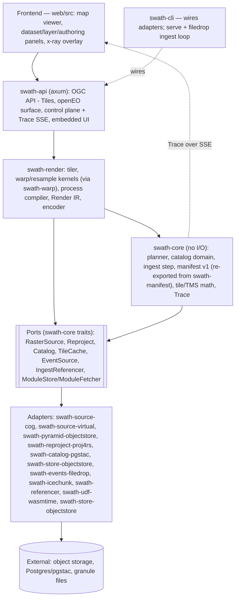

# Swath — Architecture

_Working document. Draft v0.3 — August 2026. §§4, 6, 7 and 12 describe the code as built and
carry a "last verified against sources" content fingerprint checked by the docs gate
(`crates/swath-cli/src/docs_check/stamps.rs`; on a source change the gate prints the new
fingerprint to paste after re-verifying). The remaining sections are design intent. Where any
doc disagrees with an ADR, the ADR wins; engineering standards live in `ENGINEERING.md`._

---

## 1. Purpose

Pin the shape of Swath: the **build vs adopt/bind** boundary, the **ports**, the **adapters**,
the **standards** we expose, and the **data flows** that produce the north-star metric.

## 2. Design principles (locked)

**Hexagonal / ports-and-adapters** (churn absorbed at adapters). **Standards as interface
contracts** (STAC, the OGC API family, the openEO graph — the anti-lock-in mechanism).
**Pure-Rust core, single static binary** (adopt reader/codec crates, bind projection math,
never reimplement PROJ or format drivers). **Glass-box by construction** (every render emits a
decision **Trace** powering the x-ray UI _and_ serving as the test oracle). **Intuitive out of
the box; resilient to extension** (one command; extensions plug in at the ports).
**Priorities:** correctness → performance/memory → UX → safety → docs → standards breadth.

## 3. The build / adopt / bind / never boundary

| Layer | Decision | Concretely |
| --- | --- | --- |
| Tiler brain, planner, orchestration, trace, compiler + Render IR | **BUILD** | `swath-render`, `swath-core` |
| COG / Zarr / virtual-reference reading | **ADOPT** | `async-geotiff`/`async-tiff`, `zarrs`, `object_store` |
| Image encoding, HTTP, async runtime, vector/columnar | **ADOPT** | `image`/`png`/`webp`, `axum`, `tokio`, `geoarrow-rs` |
| Projection / datum math | **BIND** (prefer pure-Rust) | `proj4rs`; `proj` C-bindings feature-gated for the long tail |
| Legacy virtual-reference _generation_ | **ADOPT (Python, ingest-time only)** | `VirtualiZarr`/`kerchunk` sidecar; Rust reads the manifest at serve time |
| Projection/datum catalog, format drivers, general GDAL warp | **NEVER reimplement** | (GDAL/rio-tiler live only in the test suite as a correctness oracle) |

## 4. Component model

Every node names a real crate or module. Nothing here is aspirational: deferred surfaces (Maps,
Records, Processes, EDR, Features, embeddings) appear only in the §7 phase tables and in the
standards map ([`docs/media/standards-map.svg`](media/standards-map.svg), evidence ledger in
[`standards-map.notes.md`](media/standards-map.notes.md)).



All nodes are implemented (per-module detail lives in each crate's rustdoc); the Python
`VirtualiZarr` sidecar is deliberately absent — the conformance *reference* for
`swath-referencer` (ADR 0006), not a runtime component.

_Last verified against sources `a66f2c0b7692`._

## 5. The Core (pure logic)

The **tiler engine** produces an encoded tile + a `Trace`; the **planner** chooses
`CacheHit | Overview | Live` per `(layer, tile/zoom)` under a per-layer **Budget**, reasoning
into the Trace; the **process compiler** lowers the openEO subset into a typed `RenderPlan`
(the graph is _interchange_, the IR is _ours_); the **catalog service** is the "make STAC
disappear" domain; the **ingest orchestrator** reacts to `EventSource`, registers assets or
triggers legacy virtualization, and owns the ingest-to-pixel timer; the **Trace** (§9) rides
with every render.

## 6. Ports — trait signatures

The signatures below are from the named files (doc comments, bodies, and async return types
elided); the rustdoc on each trait and module is the normative contract — including the
domain-shaped `Catalog` ([`docs/design/catalog-domain.md`](design/catalog-domain.md), §16.5),
the pull-shaped `EventSource`, no `ProcessRegistry` port (ADR 0010), and `IngestReferencer`
(ADR 0006).

```rust
// crates/swath-core/src/source.rs — async methods return
// impl Future<Output = Result<…, SourceError>> + Send (elided as … below,
// here and in the async traits that follow)
pub trait RasterSource: Send + Sync {
    fn describe(&self, asset: &AssetRef) -> …;
    fn read_window(
        &self,
        asset: &AssetRef,
        window: WindowRequest,
        band: BandSelection,
        level: ReadLevel,
    ) -> …;
}

// crates/swath-core/src/reproject.rs (sync, dyn-compatible)
pub trait CoordTransform: Send + Sync {
    fn transform(&self, x: f64, y: f64) -> Result<(f64, f64), ReprojectError>;
    fn transform_slice(&self, points: &mut [(f64, f64)]) -> … { /* default: per-point loop */ }
}
pub trait Reproject: Send + Sync {
    fn transformer(&self, from: &Crs, to: &Crs) -> Result<Box<dyn CoordTransform>, ReprojectError>;
}

// crates/swath-core/src/catalog.rs — five async methods, domain-typed:
pub trait Catalog: Send + Sync {
    fn upsert_dataset(&self, dataset: &Dataset) -> …;
    fn upsert_granules(&self, granules: &[Granule]) -> …;
    fn get_dataset(&self, id: &DatasetId) -> …;
    fn list_datasets(&self) -> …;
    fn find_granules(&self, dataset: &DatasetId, query: &GranuleQuery) -> …;
}

// crates/swath-core/src/cache.rs — no TTL by design: content-derived keys
// never go stale (§10, §16.3)
pub trait TileCache: Send + Sync {
    fn get(&self, key: &TileKey) -> …;
    fn put(&self, key: &TileKey, bytes: &[u8], content_type: &str) -> …;
}

// crates/swath-core/src/events.rs (pull-shaped)
pub trait EventSource: Send {
    fn next_event(&mut self) -> …;
}

// crates/swath-core/src/ingest.rs (sync)
pub trait IngestReferencer: Send + Sync {
    fn handles(&self, granule: &Path) -> bool;
    fn generate(&self, granule: &Path) -> Result<VirtualManifest, ReferencerError>;
}

// crates/swath-core/src/udf.rs — run_udf module bytes by content hash
// (ADR 0018); the fetch happens once, at publish, never at serve time
pub trait ModuleStore: Send + Sync {
    fn get(&self, code_hash: &str) -> …;
    fn put(&self, bytes: &[u8]) -> …;
}
pub trait ModuleFetcher: Send + Sync {
    fn fetch(&self, url: &str) -> …;
}
```

The core entry points (not ports — the logic itself; the stamp fingerprints these files too):
`plan(budget, availability) -> Plan` in `crates/swath-planner/src/lib.rs` (the extracted
planner crate, ADR 0016 — re-exported at `swath_core::planner`; `PlanChoice` is
`CacheHit | Overview { factor } | Live | Refuse { .. }`); `compile(graph, ctx)` in
`crates/swath-render/src/process.rs`; `render_tile` / `render_tile_cached` in
`crates/swath-render/src/tiler.rs` — free functions generic over the ports, taking the
`run_udf` executor as a `dyn` port (ADR 0018); the cached variant owns the probe +
write-through.

_Last verified against sources `fbc2abefb87e`._

## 7. Adapters and inbound APIs

**Adapters (outbound, behind ports):**

| Port | Implemented adapter (crate) | Planned |
| --- | --- | --- |
| `RasterSource` | `swath-source-cog`; `swath-source-virtual`; `swath-icechunk` (read-back from a commit, #193); `swath-pyramid-objectstore` (pyramid overlay) | `zarrs` (native Zarr) |
| `Reproject` | `swath-reproject-proj4rs` | `proj` C-bindings |
| `Catalog` | `swath-catalog-pgstac` | — |
| `TileCache` | `swath-store-objectstore` (local/S3) | Redis hot-tile cache |
| `EventSource` | `swath-events-filedrop` | S3 notifications, CMR polling |
| `IngestReferencer` | `swath-referencer` (HDF-EOS, GRIB2; the Python sidecar as conformance reference, ADR 0006) | HDF5/NetCDF4 breadth |
| `ModuleStore` / `ModuleFetcher` | `swath-store-objectstore` (local/S3; http(s) fetch) | GC sweep (ROADMAP row 17) |
| `EmbeddingModel`/`VectorIndex` | — (frontier; no port trait yet) | model + vector index |

No `ProcessRegistry` port exists (§6): the openEO subset compiles in-core against a
`CompileContext` (ADR 0010); an external OGC Processes backend remains a possible later
seam.

**Inbound APIs (standards), by phase** (status per the standards map,
[`docs/media/standards-map.svg`](media/standards-map.svg) /
[`standards-map.notes.md`](media/standards-map.notes.md)):

| API | Target phase | Status |
| --- | --- | --- |
| OGC API - Tiles | 1 | implemented (core, tileset, tilesets-list, dataset-tilesets, png) |
| Control-plane REST + Trace SSE | 1 | implemented |
| openEO (bounded authoring profile, ADR 0010; preview `POST /result`, ADR 0014) | 1 | implemented |
| OGC API - Maps | deferred | not implemented — the standards map records the final call |
| OGC API - Records | 2 | not started |
| OGC API - Processes | 2 | not started (authoring is openEO-only, ADR 0010) |
| OGC API - EDR | 3 | not started |
| OGC API - Features | 3 | not started |

_Last verified against sources `a6ec3526748a`._

## 8. Data flows

**Tile-serve hot path:** request → resolve layer + RenderSpec → planner chooses
`CacheHit | Overview | Live` → (on a render) `RasterSource` window read → reproject/resample →
Render IR (band math → composite → colormap) → encode → write-through cache → tile + Trace.
**Ingest-to-pixel (north star):** granule event → register the asset directly (clean COG/Zarr)
or generate a virtual manifest first (legacy NetCDF/HDF) → catalog upsert (pgstac) → layer
servable; the event also starts the ingest-to-pixel timer. **Data-scientist publish** is the
same serve path: an authored openEO graph compiles to Render IR, registers a derived layer,
and the planner decides its materialization per tile.

## 9. Trace / observability model (the x-ray keystone)

Every `render_tile` returns a `Trace` and streams it over SSE: the decision
(`Live | Overview{level} | CacheHit`), source, CRS hop, bytes and chunks/byte-ranges read,
per-stage timings, the cache key, `ingest_to_pixel_ms` when known, and a `run_udf` stage's
`udf_ms` plus deterministic `udf_fuel_used` (ADR 0018). The overlay paints from it;
the test suite asserts against the same struct — observability and correctness are one
surface.

## 10. Materialization & cache model

**Cache key** = hash of `(layer_version, render_spec, tile_coord, tms)`; a `layer_version`
bump invalidates cleanly. **Overview store** (#183): per-asset GeoZarr-shaped pyramids from
`swath materialize` — batch, idempotent, resumable
(`crates/adapters/swath-pyramid-objectstore`); the `PyramidSource` overlay merges materialized
factors into `describe`, so the planner prefers an overview at low zoom unchanged. **Budget**:
the cost estimate (bytes × warp cost) vs availability decides `Live | Overview | CacheHit`,
every choice traced.

## 11. Runtime & concurrency

`tokio` + `axum`; async I/O via `object_store`; CPU-bound warp/resample runs **inline on the
async runtime** ([ADR 0012](decisions/0012-render-stays-inline-async.md)); cancellation
propagates from dropped requests to in-flight reads. Single process; horizontal scale = N
stateless instances behind a load balancer.

## 12. Crate / repo layout (as built)

The Cargo workspace is exactly the §4 component model on disk: `crates/` holds `swath-core`,
`swath-manifest` (the extracted manifest v1 schema, ADR 0016), `swath-render`, `swath-warp`
(the extracted GDAL-exact kernel, ADR 0016), `swath-planner` (the extracted cost model, ADR
0016), `swath-api`, `swath-cli`, `swath-referencer`, `swath-e2e`, and the never-shipped test
crates plus `swath-udf-guest` (the UDF authoring kit, ADR 0018), with the ten adapter
crates under `crates/adapters/`; beside it, `web/`, `python/`, `tests/`, `examples/udf/`
(the UDF example modules' standalone wasm32 workspace), `prototypes/` (dated experiments,
immutable once concluded), and `docs/`. Phase-1 adapters are direct dependencies of the binary — Cargo features gate the
embedded UI and HDF5 weight, not adapter selection (§14 covers extension beyond compile
time).

_Last verified against sources `a66f2c0b7692`._

## 13. Frontend architecture

Vanilla Web Components, TypeScript, no framework (ADR 0005); **MapLibre GL** is the single
necessary dependency; the x-ray overlay is fed by the Trace SSE stream. Deck.gl stays out until
a genuine GPU-scale need lands (ADR 0005's revisit condition). Structure per ADR 0021: one shell
(the map always present, modes in the URL), shadow-DOM primitives on design tokens —
[`design/ui-system.md`](design/ui-system.md).

## 14. Extension model (decided — ADR 0013)

**Compile-time Cargo features/crates for adapters, plus openEO process graphs at runtime** —
[ADR 0013](decisions/0013-extension-features-plus-openeo-graphs.md) records the mechanisms
weighed, the WASM/RPC deferral, and the reopen condition.

## 15. Deployment topology

Single binary `swath` + **Postgres (pgstac)** + an **object store** as the only required
infra; local `docker compose up`, cloud N stateless replicas + managed Postgres + bucket.

## 16. Open questions — status ledger

Each row links the artifact owning the full rationale — a ledger, not the argument; a
Resolved/Closed item reopens only via a superseding ADR.

| # | Item | Status | Rationale lives at |
| --- | --- | --- | --- |
| 1 | Port granularity: one `RasterSource`, or split? | Resolved | As-built port set, §6 (#152); the cube half returns with a native `zarrs` adapter (§7) — reopen trigger in [`ROADMAP.md`](ROADMAP.md) |
| 2 | Where warp lives: kernels, or a `Warp` offload port? | Resolved | As built, §6 (#152): kernels, no port; evidence in [ADR 0012](decisions/0012-render-stays-inline-async.md); GPU/GDAL offload deferred in [`ROADMAP.md`](ROADMAP.md) |
| 3 | Cache key & invalidation | Open (narrowed by #36) | `swath-core` `cache` module docs; [`ROADMAP.md`](ROADMAP.md) rows 2–3 |
| 4 | Planner budget semantics | Resolved | [`docs/design/materialization-planner.md`](design/materialization-planner.md) (#37); [`ROADMAP.md`](ROADMAP.md) rows 4–5 |
| 5 | Control-plane domain model | Resolved | [`docs/design/catalog-domain.md`](design/catalog-domain.md) |
| 6 | Extension mechanism (§14) | Closed-by-ADR | [ADR 0013](decisions/0013-extension-features-plus-openeo-graphs.md) |
| 7 | Async vs blocking render boundary | Resolved | [ADR 0012](decisions/0012-render-stays-inline-async.md) |
| 8 | The Python ingest seam | Resolved | [ADR 0006](decisions/0006-legacy-referencer-staged.md); Rust stage shipped (§7) |
