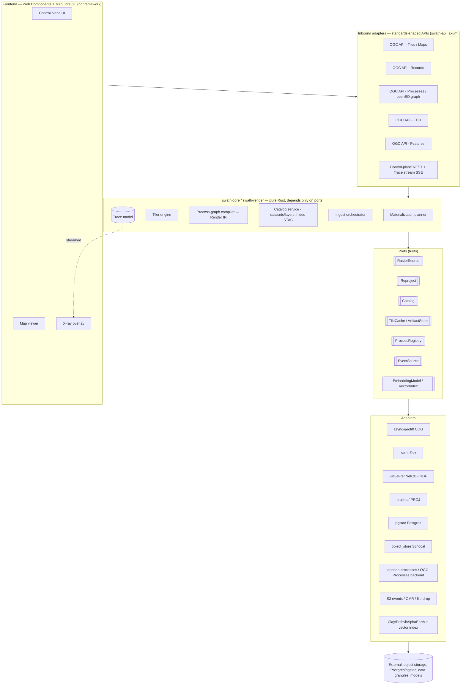
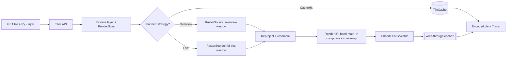
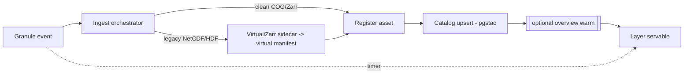

# Swath — Architecture

_Working document. Draft v0.2 — August 2026. Written for refinement: the module layout and port
signatures here are proposals to iterate on, not yet frozen. The charter (v0.2) has been reconciled
with the ADRs; where any doc disagrees with an ADR, the ADR wins. Engineering standards (toolchains,
CI, testing, release) live in `ENGINEERING.md`._

---

## 1. Purpose

Pin the shape of Swath before any code: the boundary between what we **build** and what we **adopt/bind**,
the **ports** (stable interfaces) the core depends on, the **adapters** behind them, the **standards** we
expose, and the **data flows** that produce the north-star metric (ingest-to-pixel latency). If this doc
is right, the scaffold is a transcription of it.

## 2. Design principles (locked)

1. **Hexagonal / ports-and-adapters.** A small, portable core depends only on narrow port traits and
   standard data types. Everything external is an adapter. Ecosystem churn is absorbed at adapters; the
   core never breaks because it only knows _standards_, not tools.
2. **Standards as interface contracts.** Ports are shaped like STAC, the OGC API family, and the
   openEO/OGC-Processes graph. Standards-as-interfaces _is_ the anti-lock-in mechanism.
3. **Pure-Rust core, single static binary.** The tiler + materialization engine + control-plane logic are
   Rust IP. Adopt Rust reader/codec crates; bind projection math; never reimplement PROJ or format drivers.
4. **Glass-box by construction.** Every render emits a structured decision **Trace**. The Trace powers the
   x-ray UI _and_ is the test oracle. Observability and correctness are one surface.
5. **Intuitive out of the box; resilient to extension.** One command, sane defaults. Extensions plug in at
   the ports with a small, well-documented surface — never by editing the core.
6. **Priorities, in order:** correctness → performance/memory → UX/intuitiveness → safety → docs →
   standards conformance breadth. (Breadth is last: we go deep on a vertical before wide.)

## 3. The build / adopt / bind / never boundary

| Layer                                                                                                            | Decision                             | Concretely                                                                            |
| ---------------------------------------------------------------------------------------------------------------- | ------------------------------------ | ------------------------------------------------------------------------------------- |
| Tiler brain (window/overview selection, warp+resample kernels, pixel ops, tile API, **per-tile decision hooks**) | **BUILD**                            | `swath-render`, `swath-core`                                                          |
| Materialization planner, process compiler + IR, catalog/ingest orchestration, trace model                        | **BUILD**                            | `swath-core`                                                                          |
| COG / Zarr / virtual-reference reading                                                                           | **ADOPT**                            | `async-geotiff`/`async-tiff`, `zarrs` (+`zarrs_icechunk`), `object_store`             |
| Image encoding, HTTP, async runtime, vector/columnar                                                             | **ADOPT**                            | `image`/`png`/`webp`, `axum`, `tokio`, `geoarrow-rs`                                  |
| Projection / datum math                                                                                          | **BIND** (prefer pure-Rust)          | `proj4rs` (common CRS); `proj` C-bindings feature-gated for the long tail             |
| Legacy virtual-reference _generation_ (NetCDF/HDF → virtual Zarr)                                                | **ADOPT (Python, ingest-time only)** | `VirtualiZarr`/`kerchunk` as an ingest sidecar; Rust reads the manifest at serve time |
| Projection/datum catalog, universal format drivers, general GDAL warp                                            | **NEVER reimplement**                | (GDAL/rio-tiler live only in the test suite as a correctness oracle)                  |

## 4. Component model



## 5. The Core (pure logic)

- **Tiler engine** (`swath-render`, orchestrated from `swath-core`): given a `ResolvedLayer`, a `TileCoord`,
  and a `RenderSpec`, produce an encoded tile + a `Trace`. Reads pixels via `RasterSource`, transforms via
  `Reproject`, applies the compiled render IR (resample → band math → composite → colormap → encode).
- **Materialization planner**: chooses, per `(layer, tile/zoom)`, one of `CacheHit | Overview | Live` under a
  per-layer storage-vs-latency **Budget**, consulting availability (cache, overviews). Emits its reasoning
  into the Trace. This is the systematized "on-the-fly vs cache" decision.
- **Process compiler → Render IR**: parses a standard process graph (openEO/OGC-Processes JSON) and lowers
  the supported subset into a typed, executable `RenderPlan` the tiler runs. The graph is _interchange_;
  the IR is _ours_.
- **Catalog service**: the "make STAC disappear" domain. Models `Dataset` and `Layer`; persists via the
  `Catalog` port (STAC-shaped) so users never touch STAC JSON.
- **Ingest orchestrator**: reacts to `EventSource`, registers clean assets or triggers legacy virtualization,
  upserts the catalog, optionally warms overviews. Owns the ingest-to-pixel timer.
- **Trace model**: a first-class structured record (see §9) returned with every render and streamed to the UI.

## 6. Ports — representative trait sketches (illustrative, for refinement)

```rust
/// Read windowed samples from a source asset. Async + cancellation-friendly.
#[async_trait]
pub trait RasterSource: Send + Sync {
    async fn describe(&self, asset: &AssetRef) -> Result<RasterInfo>; // CRS, bounds, bands, dtype, overviews
    async fn read_window(&self, asset: &AssetRef, req: WindowRequest) -> Result<WindowData>; // + provenance
}

/// Coordinate transforms. Kept minimal; warp/resample live in the core, not here.
pub trait Reproject: Send + Sync {
    fn transformer(&self, from: &Crs, to: &Crs) -> Result<Box<dyn CoordTransform>>;
}

/// Catalog CRUD, STAC-shaped contract. The core speaks Datasets/Layers above this.
#[async_trait]
pub trait Catalog: Send + Sync {
    async fn upsert_collection(&self, c: &Collection) -> Result<()>;
    async fn upsert_items(&self, items: &[Item]) -> Result<()>;
    async fn search(&self, q: &SearchQuery) -> Result<ItemPage>;
}

/// Encoded-tile cache and materialized-artifact (overview) store.
#[async_trait]
pub trait TileCache: Send + Sync {
    async fn get(&self, key: &TileKey) -> Result<Option<EncodedTile>>;
    async fn put(&self, key: &TileKey, tile: &EncodedTile, ttl: Option<Duration>) -> Result<()>;
}

/// Resolve process definitions/semantics (openEO processes catalog).
pub trait ProcessRegistry: Send + Sync {
    fn resolve(&self, id: &ProcessId) -> Result<ProcessDef>;
}

/// Ingest triggers.
#[async_trait]
pub trait EventSource: Send + Sync {
    async fn subscribe(&self) -> Result<BoxStream<'static, GranuleEvent>>;
}
```

Core entry points (not ports — this is the logic itself):

```rust
pub fn compile(graph: &ProcessGraph, reg: &dyn ProcessRegistry) -> Result<RenderPlan>;

pub enum Strategy { CacheHit(TileKey), Overview { level: u8 }, Live }
pub fn plan(layer: &ResolvedLayer, coord: TileCoord, budget: &Budget, avail: &Availability) -> Strategy;

impl Tiler {
    pub async fn render_tile(&self, layer: &ResolvedLayer, coord: TileCoord, spec: &RenderSpec)
        -> Result<(EncodedTile, Trace)>;
}
```

## 7. Adapters and inbound APIs

**Adapters (outbound, behind ports):**

| Port                           | Phase-1 adapter             | Later adapters                                                      |
| ------------------------------ | --------------------------- | ------------------------------------------------------------------- |
| `RasterSource`                 | `async-geotiff` (COG, HLS)  | `zarrs` (Zarr), virtual-ref (NetCDF/HDF via VirtualiZarr manifests) |
| `Reproject`                    | `proj4rs` (UTM↔WebMercator) | `proj` C-bindings (geostationary/exotic)                            |
| `Catalog`                      | `pgstac`                    | —                                                                   |
| `TileCache`/`ArtifactStore`    | `object_store` (local/S3)   | Redis hot-tile cache                                                |
| `ProcessRegistry`              | built-in openEO subset      | external OGC Processes backend (batch materialization)              |
| `EventSource`                  | file-drop / manual register | S3 notifications, CMR polling                                       |
| `EmbeddingModel`/`VectorIndex` | —                           | Clay/Prithvi/AlphaEarth + vector index (frontier)                   |

**Inbound APIs (standards), by phase:**

| API                                | Purpose                             | Target phase |
| ---------------------------------- | ----------------------------------- | ------------ |
| OGC API - Tiles / Maps             | raster + derived-product tiles      | 1            |
| Control-plane REST + Trace SSE     | datasets/layers mgmt + x-ray stream | 1            |
| OGC API - Records                  | catalog/discovery                   | 2            |
| OGC API - Processes / openEO graph | product authoring                   | 2            |
| OGC API - EDR                      | point/time-series from cubes        | 3            |
| OGC API - Features                 | vector/GeoParquet                   | 3            |

## 8. Data flows

**Tile-serve hot path (the materialization decision):**



**Ingest-to-pixel (north star):**



**Data-scientist product publish:**


## 9. Trace / observability model (the x-ray keystone)

Every `render_tile` returns a `Trace` and streams it over SSE. Shape (illustrative):

```rust
pub struct Trace {
    pub decision: Strategy,            // Live | Overview{level} | CacheHit
    pub source: AssetRef,
    pub crs_from: Crs, pub crs_to: Crs,
    pub bytes_read: u64,
    pub chunks_or_ranges: Vec<Provenance>, // Zarr chunks or COG byte-ranges touched
    pub timings_ms: Timings,           // read, warp, resample, pixel_ops, encode
    pub cache_key: TileKey,
    pub ingest_to_pixel_ms: Option<u64>, // when this tile reflects a just-ingested granule
}
```

Uses: the overlay paints per-tile decisions + a cache-hit heatmap and shows timings/bytes; the test suite
asserts against the same struct ("z3 must be `Overview`, not `Live`"); a perceptual-diff test compares the
encoded tile to a GDAL-rendered reference.

## 10. Materialization & cache model

- **Cache key** = hash of `(layer_version, render_spec, tile_coord, tms)`. A `layer_version` bump (new data
  or new graph) invalidates cleanly — no scattered invalidation.
- **Overview/artifact store**: pre-computed GeoZarr pyramids / COG overviews per layer, produced by the
  batch-materialization path; the planner prefers an overview at low zoom to avoid full-res reads.
- **Budget**: per-layer policy trading storage vs latency; the planner's cost estimate (bytes × warp cost)
  vs. overview/cache availability decides `Live | Overview | CacheHit`. Every choice is traced.

## 11. Runtime & concurrency

`tokio` + `axum`. Async I/O via `object_store`; CPU-bound warp/resample on a `rayon` pool or `spawn_blocking`
with bounded concurrency and backpressure. Cancellation propagates from dropped requests down to in-flight
reads. Single process; horizontal scale by running N stateless instances behind a load balancer (state lives
in Postgres + object store + optional Redis).

## 12. Crate / repo layout (proposed)

```
swath/                      # Cargo workspace
  crates/
    swath-core/             # domain types, port traits, planner, compiler+IR, tiler orchestration, Trace — no I/O
    swath-render/           # warp/resample kernels, pixel ops, encoding (depends on core + image/proj crates)
    swath-api/              # inbound: axum, OGC APIs, openEO endpoint, control-plane, Trace SSE
    swath-ingest/           # ingest orchestrator + timer
    swath-cli/              # single binary: `swath serve` / `swath ingest` / `swath register`
    adapters/
      swath-source-cog/     swath-source-zarr/     swath-source-virtual/
      swath-reproject-proj4rs/   swath-reproject-proj/   (feature-gated)
      swath-catalog-pgstac/ swath-store-objectstore/
      swath-events-s3/      swath-events-cmr/      swath-events-filedrop/
  ui/                       # Web Components + MapLibre GL (TypeScript, no framework)
  py/                       # thin ingest-time sidecars (VirtualiZarr reference generation)
  tests/                    # oracle (perceptual-diff vs GDAL) + OGC conformance
  docs/
```

Adapters are wired at the binary via Cargo features (default set = out-of-the-box). See §14 for third-party
extension beyond compile-time features.

## 13. Frontend architecture

- **Vanilla Web Components / Custom Elements**, TypeScript, a tiny in-house reactive/state layer — no React,
  no deck.gl. **MapLibre GL** is the single necessary dependency (WebGL map renderer; BSD; framework-agnostic).
- **X-ray overlay** as a MapLibre **custom WebGL layer** (or Canvas overlay) fed by the Trace SSE stream:
  per-tile decision coloring, cache-hit heatmap, timing/bytes inspector.
- Deck.gl stays out until a genuine GPU-scale vector/point/3D need lands (e.g. dense embeddings scatter),
  and then only as an isolated, optional visualization module.

## 14. Extension model (OPEN — needs refinement, see §16)

Three candidate mechanisms for third-party adapters/processes, trading "single-binary simplicity" vs.
"extend without recompiling":

1. **Compile-time Cargo features** — simplest, single static binary, but extending means a rebuild.
2. **WASM plug-ins** — third-party sources/processes as sandboxed WASM modules loaded at runtime; portable
   and safe, but a defined host ABI and perf overhead.
3. **Sidecar processes over a stable RPC** — language-agnostic (a Python source adapter, say), but adds
   process-management and a serialization seam.

Leaning: compile-time features for first-party adapters (out-of-box), **plus** the _standard APIs themselves_
as the primary extension surface (a custom product is just an openEO graph via the Processes API — no plugin
needed), with WASM as the eventual answer for custom sources/kernels. To be decided.

## 15. Deployment topology

Single binary `swath` + **Postgres (pgstac)** + an **object store** (S3/MinIO/local) as the only required
infra; optional Redis for a hot-tile cache. Local: `docker compose up`. Cloud: the binary (N stateless
replicas) + managed Postgres + bucket. The pure-Rust core keeps the image tiny and the cold-start fast.

## 16. Open questions to refine (next iteration)

1. **Port granularity.** Is `RasterSource` one port, or split (metadata/`describe` vs `read_window`, and
   raster vs. cube)? Cube reads (Zarr, N-dim) may want a distinct `CubeSource` with dimension selection.
2. **Where warp lives.** Kernels in `swath-render` calling a minimal `Reproject` port (current proposal) —
   or a richer `Warp` port so an adapter could offload to GPU/GDAL later? Trade purity vs. future options.
3. **Cache key & invalidation.** Is `layer_version` monotonic per layer, content-hash, or a vector clock?
   How do partial-data updates (a new granule in a mosaic) invalidate only affected tiles?
4. **Planner budget semantics.** Per-layer policy knobs vs. a global cost model that learns from Trace
   history. How much of Phase 1 does the planner actually need (MVP could be "always Live" + Trace)?
5. **Control-plane domain model.** Exact `Dataset`/`Layer` schema that cleanly hides STAC yet round-trips
   to it losslessly. This is the "make STAC disappear" contract and deserves its own mini-spec.
   *(Resolved by [`docs/design/catalog-domain.md`](design/catalog-domain.md): `Dataset`/`Granule`/`Layer`
   map to STAC Collection/Item with swath-owned fields under a `swath:` prefix — `Layer`s stored as
   `swath:layers` on the Collection — and a proptest-enforced domain→STAC→domain identity. The `Catalog`
   port is domain-shaped, refining the §6 sketch: STAC types appear only inside adapters.)*
6. **Extension mechanism (§14).** Commit to compile-time features for v1 and defer WASM? Confirm.
7. **Async vs blocking render boundary.** `spawn_blocking` + `rayon` vs a dedicated render threadpool with a
   work-stealing queue and admission control (matters under load and for the latency budget).
8. **The Python ingest seam.** Is VirtualiZarr-as-sidecar acceptable long-term for legacy reference
   generation, or do we want a Rust reader for kerchunk/virtual manifests to keep even ingest pure-Rust?
   *(Resolved by ADR 0006: staged Python→Rust behind one manifest port; evidence from prototype 0001.)*
