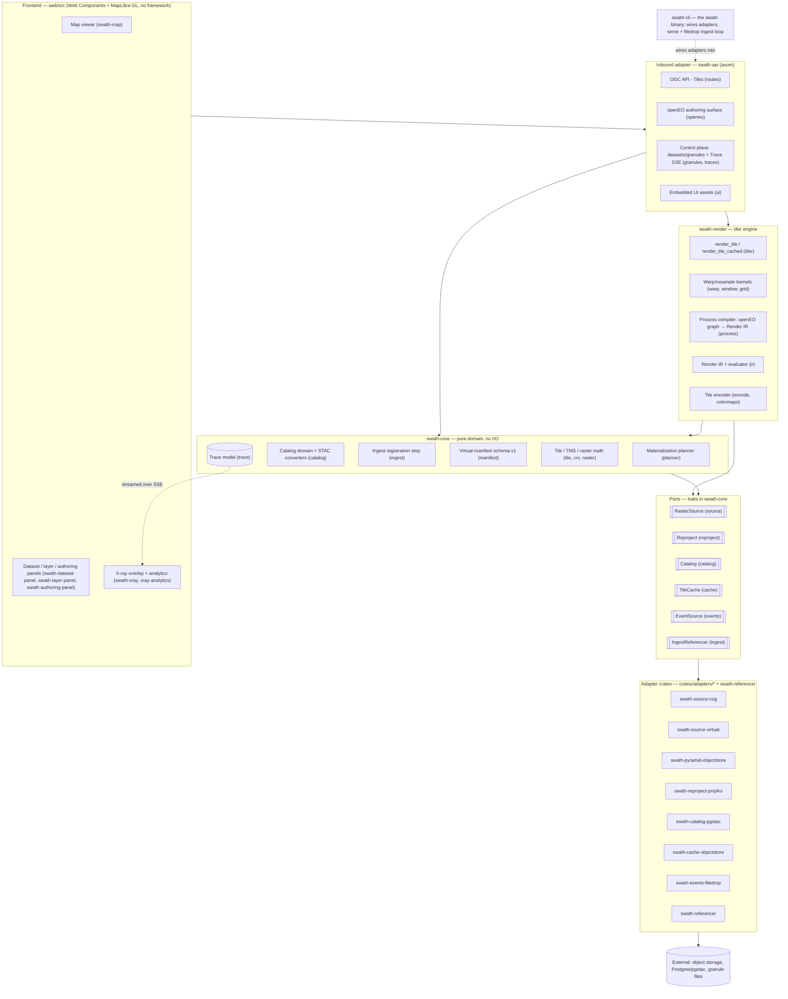
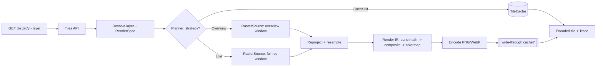
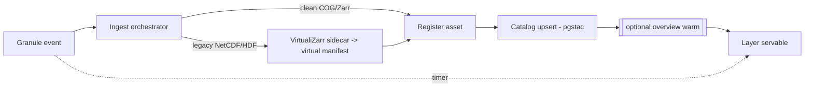

# Swath — Architecture

_Working document. Draft v0.3 — August 2026. §§4, 6, 7 and 12 now describe the code as built and
carry a "last verified against" commit; the remaining sections are design intent. The charter (v0.2)
has been reconciled with the ADRs; where any doc disagrees with an ADR, the ADR wins. Engineering
standards (toolchains, CI, testing, release) live in `ENGINEERING.md`._

---

## 1. Purpose

Pin the shape of Swath before any code: the boundary between what we **build** and what we **adopt/bind**,
the **ports** (stable interfaces) the core depends on, the **adapters** behind them, the **standards** we
expose, and the **data flows** that produce the north-star metric (ingest-to-pixel latency). If this doc
is right, the scaffold is a transcription of it.

## 2. Design principles (locked)

1. **Hexagonal / ports-and-adapters.** A small, portable core depends only on narrow port traits and
   standard data types. Everything external is an adapter. Ecosystem churn is absorbed at adapters; the
   core never breaks because it only knows _standards_, not tools.
2. **Standards as interface contracts.** Ports are shaped like STAC, the OGC API family, and the
   openEO/OGC-Processes graph. Standards-as-interfaces _is_ the anti-lock-in mechanism.
3. **Pure-Rust core, single static binary.** The tiler + materialization engine + control-plane logic are
   Rust IP. Adopt Rust reader/codec crates; bind projection math; never reimplement PROJ or format drivers.
4. **Glass-box by construction.** Every render emits a structured decision **Trace**. The Trace powers the
   x-ray UI _and_ is the test oracle. Observability and correctness are one surface.
5. **Intuitive out of the box; resilient to extension.** One command, sane defaults. Extensions plug in at
   the ports with a small, well-documented surface — never by editing the core.
6. **Priorities, in order:** correctness → performance/memory → UX/intuitiveness → safety → docs →
   standards conformance breadth. (Breadth is last: we go deep on a vertical before wide.)

## 3. The build / adopt / bind / never boundary

| Layer                                                                                                            | Decision                             | Concretely                                                                            |
| ---------------------------------------------------------------------------------------------------------------- | ------------------------------------ | ------------------------------------------------------------------------------------- |
| Tiler brain (window/overview selection, warp+resample kernels, pixel ops, tile API, **per-tile decision hooks**) | **BUILD**                            | `swath-render`, `swath-core`                                                          |
| Materialization planner, catalog/ingest orchestration, trace model; process compiler + Render IR                 | **BUILD**                            | `swath-core` (planner, catalog, ingest, trace); `swath-render` (compiler + IR)        |
| COG / Zarr / virtual-reference reading                                                                           | **ADOPT**                            | `async-geotiff`/`async-tiff`, `zarrs` (+`zarrs_icechunk`), `object_store`             |
| Image encoding, HTTP, async runtime, vector/columnar                                                             | **ADOPT**                            | `image`/`png`/`webp`, `axum`, `tokio`, `geoarrow-rs`                                  |
| Projection / datum math                                                                                          | **BIND** (prefer pure-Rust)          | `proj4rs` (common CRS); `proj` C-bindings feature-gated for the long tail             |
| Legacy virtual-reference _generation_ (NetCDF/HDF → virtual Zarr)                                                | **ADOPT (Python, ingest-time only)** | `VirtualiZarr`/`kerchunk` as an ingest sidecar; Rust reads the manifest at serve time |
| Projection/datum catalog, universal format drivers, general GDAL warp                                            | **NEVER reimplement**                | (GDAL/rio-tiler live only in the test suite as a correctness oracle)                  |

## 4. Component model

Every node below names a real crate or module (crate in the subgraph title, module or component in
parentheses on the node). Nothing here is aspirational: deferred surfaces (Maps, Records, Processes,
EDR, Features, embeddings) appear only in the §7 phase tables and in the standards map
([`docs/media/standards-map.svg`](media/standards-map.svg), evidence ledger in
[`standards-map.notes.md`](media/standards-map.notes.md)).



All nodes are implemented (no planned/phantom nodes remain, so no implemented-vs-planned styling is
needed). The Python `VirtualiZarr` sidecar (`python/sidecars/referencer`) is deliberately absent: it
is the conformance *reference* for `swath-referencer` (ADR 0006), not a runtime component.

_Last verified against `576324d`._

## 5. The Core (pure logic)

- **Tiler engine** (`swath-render`, orchestrated from `swath-core`): given a `ResolvedLayer`, a `TileCoord`,
  and a `RenderSpec`, produce an encoded tile + a `Trace`. Reads pixels via `RasterSource`, transforms via
  `Reproject`, applies the compiled render IR (resample → band math → composite → colormap → encode).
- **Materialization planner**: chooses, per `(layer, tile/zoom)`, one of `CacheHit | Overview | Live` under a
  per-layer storage-vs-latency **Budget**, consulting availability (cache, overviews). Emits its reasoning
  into the Trace. This is the systematized "on-the-fly vs cache" decision.
- **Process compiler → Render IR**: parses a standard process graph (openEO/OGC-Processes JSON) and lowers
  the supported subset into a typed, executable `RenderPlan` the tiler runs. The graph is _interchange_;
  the IR is _ours_.
- **Catalog service**: the "make STAC disappear" domain. Models `Dataset` and `Layer`; persists via the
  `Catalog` port (STAC-shaped) so users never touch STAC JSON.
- **Ingest orchestrator**: reacts to `EventSource`, registers clean assets or triggers legacy virtualization,
  upserts the catalog, optionally warms overviews. Owns the ingest-to-pixel timer.
- **Trace model**: a first-class structured record (see §9) returned with every render and streamed to the UI.

## 6. Ports — trait signatures (verbatim from source)

The signatures below are copied verbatim from the named files (doc comments and method bodies
elided); the rustdoc on each trait and its module is the normative contract. Design points that
supersede the v0.1 sketches:

- **Native async-in-trait** (`impl Future … + Send`), not `#[async_trait]`. The async ports are
  deliberately **not dyn-compatible**; consumers are generic over them. `Reproject`,
  `CoordTransform`, and `IngestReferencer` are sync and dyn-compatible on purpose.
- **`Catalog` is domain-shaped** (`Dataset`/`Granule`), not STAC-shaped — STAC types appear only
  inside adapters ([`docs/design/catalog-domain.md`](design/catalog-domain.md), §16.5).
- **`EventSource` is pull-shaped** (`&mut self`, one event per call), not a subscribed stream.
- **There is no `ProcessRegistry` port.** The openEO compiler resolves its bounded process subset
  against a `CompileContext` (ADR 0010); process definitions are data, not an adapter seam.
- **`IngestReferencer` is a port the sketches lacked** — virtual-reference generation (ADR 0006).

```rust
// crates/swath-core/src/source.rs
pub trait RasterSource: Send + Sync {
    fn describe(
        &self,
        asset: &AssetRef,
    ) -> impl Future<Output = Result<RasterInfo, SourceError>> + Send;

    fn read_window(
        &self,
        asset: &AssetRef,
        window: WindowRequest,
        band: BandSelection,
        level: ReadLevel,
    ) -> impl Future<Output = Result<WindowData, SourceError>> + Send;
}

// crates/swath-core/src/reproject.rs
pub trait CoordTransform: Send + Sync {
    fn transform(&self, x: f64, y: f64) -> Result<(f64, f64), ReprojectError>;

    fn transform_slice(&self, points: &mut [(f64, f64)]) -> Result<(), ReprojectError> { /* default: per-point loop */ }
}

pub trait Reproject: Send + Sync {
    fn transformer(&self, from: &Crs, to: &Crs) -> Result<Box<dyn CoordTransform>, ReprojectError>;
}

// crates/swath-core/src/catalog.rs
pub trait Catalog: Send + Sync {
    fn upsert_dataset(
        &self,
        dataset: &Dataset,
    ) -> impl Future<Output = Result<(), CatalogError>> + Send;

    fn upsert_granules(
        &self,
        granules: &[Granule],
    ) -> impl Future<Output = Result<(), CatalogError>> + Send;

    fn get_dataset(
        &self,
        id: &DatasetId,
    ) -> impl Future<Output = Result<Option<Dataset>, CatalogError>> + Send;

    fn list_datasets(&self) -> impl Future<Output = Result<Vec<Dataset>, CatalogError>> + Send;

    fn find_granules(
        &self,
        dataset: &DatasetId,
        query: &GranuleQuery,
    ) -> impl Future<Output = Result<Vec<Granule>, CatalogError>> + Send;
}

// crates/swath-core/src/cache.rs — no TTL by design: content-derived keys
// never go stale (§10, §16.3)
pub trait TileCache: Send + Sync {
    fn get(
        &self,
        key: &TileKey,
    ) -> impl Future<Output = Result<Option<CachedTile>, CacheError>> + Send;

    fn put(
        &self,
        key: &TileKey,
        bytes: &[u8],
        content_type: &str,
    ) -> impl Future<Output = Result<(), CacheError>> + Send;
}

// crates/swath-core/src/events.rs
pub trait EventSource: Send {
    fn next_event(
        &mut self,
    ) -> impl Future<Output = Result<Option<GranuleEvent>, EventError>> + Send;
}

// crates/swath-core/src/ingest.rs
pub trait IngestReferencer: Send + Sync {
    fn handles(&self, granule: &Path) -> bool;

    fn generate(&self, granule: &Path) -> Result<VirtualManifest, ReferencerError>;
}
```

Core entry points (not ports — this is the logic itself; same files are normative):

```rust
// crates/swath-core/src/planner.rs — PlanChoice is
// CacheHit | Overview { factor } | Live | Refuse { .. } (#[non_exhaustive])
pub fn plan(budget: &Budget, availability: &Availability) -> Plan;

// crates/swath-render/src/process.rs (Json = serde_json::Value)
pub fn compile(graph: &Json, ctx: &CompileContext) -> Result<CompiledProduct, CompileError>;

// crates/swath-render/src/tiler.rs — free functions generic over the ports,
// not a Tiler struct; the cached variant owns the probe + write-through
pub async fn render_tile<S: RasterSource, R: Reproject + ?Sized>(
    source: &S,
    reproject: &R,
    request: &TileRequest,
) -> Result<(EncodedTile, Trace), TileError>;

pub async fn render_tile_cached<S, R, C>(
    source: &S,
    reproject: &R,
    cache: &C,
    key: &TileKey,
    request: &TileRequest,
) -> Result<(EncodedTile, Trace), TileError>
where
    S: RasterSource,
    R: Reproject + ?Sized,
    C: TileCache;
```

_Last verified against `576324d`._

## 7. Adapters and inbound APIs

**Adapters (outbound, behind ports):**

| Port                           | Implemented adapter (crate)                                                                                     | Planned adapters                                  |
| ------------------------------ | ---------------------------------------------------------------------------------------------------------------- | ------------------------------------------------- |
| `RasterSource`                 | `swath-source-cog` (COG/HLS over `object_store`); `swath-source-virtual` (virtual-reference manifests); `swath-pyramid-objectstore` (materialized-pyramid overlay over either) | `zarrs` (native Zarr stores)                      |
| `Reproject`                    | `swath-reproject-proj4rs` (pure Rust)                                                                            | `proj` C-bindings (geostationary/exotic)          |
| `Catalog`                      | `swath-catalog-pgstac` (Postgres + pgstac)                                                                       | —                                                 |
| `TileCache`                    | `swath-cache-objectstore` (local/S3)                                                                             | Redis hot-tile cache                              |
| `EventSource`                  | `swath-events-filedrop` (watched drop directory)                                                                 | S3 notifications, CMR polling                     |
| `IngestReferencer`             | `swath-referencer` (pure Rust: HDF-EOS, GRIB2; Python `VirtualiZarr` sidecar as conformance reference, ADR 0006) | HDF5/NetCDF4 breadth                              |
| `EmbeddingModel`/`VectorIndex` | — (frontier; no port trait defined yet)                                                                          | Clay/Prithvi/AlphaEarth + vector index            |

There is no `ProcessRegistry` port (see §6): the openEO process subset is compiled in-core against
a `CompileContext` (ADR 0010). An external OGC Processes backend for batch materialization remains
a possible later seam and would get its own port when it lands.

**Inbound APIs (standards), by phase** (implementation status per the standards map,
[`docs/media/standards-map.svg`](media/standards-map.svg) /
[`standards-map.notes.md`](media/standards-map.notes.md)):

| API                                     | Purpose                             | Target phase | Status                                          |
| --------------------------------------- | ----------------------------------- | ------------ | ----------------------------------------------- |
| OGC API - Tiles                         | raster + derived-product tiles      | 1            | implemented (core, tileset, tilesets-list, dataset-tilesets, png) |
| Control-plane REST + Trace SSE          | datasets/layers mgmt + x-ray stream | 1            | implemented                                     |
| openEO (bounded authoring profile)      | product authoring (ADR 0010); preview `POST /result` (ADR 0014) | 1            | implemented                                     |
| OGC API - Maps                          | styled map imagery                  | deferred     | not implemented — an earlier draft paired it with Tiles at phase 1, but no endpoints, conformance classes, or tests exist; the standards map records the final call |
| OGC API - Records                       | catalog/discovery                   | 2            | not started                                     |
| OGC API - Processes                     | batch/externalized processing       | 2            | not started (authoring is openEO-only, ADR 0010) |
| OGC API - EDR                           | point/time-series from cubes        | 3            | not started                                     |
| OGC API - Features                      | vector/GeoParquet                   | 3            | not started                                     |

_Last verified against `576324d`._

## 8. Data flows

**Tile-serve hot path (the materialization decision):**



**Ingest-to-pixel (north star):**



**Data-scientist product publish:**


## 9. Trace / observability model (the x-ray keystone)

Every `render_tile` returns a `Trace` and streams it over SSE. Shape (illustrative):

```rust
pub struct Trace {
    pub decision: Strategy,            // Live | Overview{level} | CacheHit
    pub source: AssetRef,
    pub crs_from: Crs, pub crs_to: Crs,
    pub bytes_read: u64,
    pub chunks_or_ranges: Vec<Provenance>, // Zarr chunks or COG byte-ranges touched
    pub timings_ms: Timings,           // read, warp, resample, pixel_ops, encode
    pub cache_key: TileKey,
    pub ingest_to_pixel_ms: Option<u64>, // when this tile reflects a just-ingested granule
}
```

Uses: the overlay paints per-tile decisions + a cache-hit heatmap and shows timings/bytes; the test suite
asserts against the same struct ("z3 must be `Overview`, not `Live`"); a perceptual-diff test compares the
encoded tile to a GDAL-rendered reference.

## 10. Materialization & cache model

- **Cache key** = hash of `(layer_version, render_spec, tile_coord, tms)`. A `layer_version` bump (new data
  or new graph) invalidates cleanly — no scattered invalidation.
- **Overview/artifact store** (shipped, issue #183): per-asset GeoZarr-shaped pyramids (plain Zarr v2
  over `object_store`, `pyramids/` under the store root), produced by `swath materialize` — batch,
  idempotent, resumable (`crates/adapters/swath-pyramid-objectstore`). The `PyramidSource` overlay
  merges materialized factors into `describe` and serves them from stored chunks, so the planner
  prefers an overview at low zoom without any planner change; COG-embedded overviews keep serving
  from the asset itself and are never duplicated.
- **Budget**: per-layer policy trading storage vs latency; the planner's cost estimate (bytes × warp cost)
  vs. overview/cache availability decides `Live | Overview | CacheHit`. Every choice is traced.

## 11. Runtime & concurrency

`tokio` + `axum`. Async I/O via `object_store`; CPU-bound warp/resample runs **inline on the async
runtime** — the earlier `rayon`/`spawn_blocking` sketch is superseded by
[ADR 0012](decisions/0012-render-stays-inline-async.md) (load-evidence resolution of §16.7, reopen
trigger recorded there). Cancellation propagates from dropped requests down to in-flight
reads. Single process; horizontal scale by running N stateless instances behind a load balancer (state lives
in Postgres + object store + optional Redis).

## 12. Crate / repo layout (as built)

```
swath/                          # Cargo workspace
  crates/
    swath-core/                 # domain types, port traits, planner, tile/TMS math, manifest schema, Trace — no I/O
    swath-render/               # warp/resample kernels, Render IR + evaluator, openEO process compiler, tiler, encoding
    swath-api/                  # inbound axum surface: OGC API - Tiles, openEO authoring, control plane + Trace SSE, embedded UI
    swath-cli/                  # the `swath` binary: `swath serve` (catalog mode runs the filedrop ingest loop) / `swath ingest`
    swath-referencer/           # pure-Rust virtual-reference generator (`IngestReferencer` impl: HDF-EOS, GRIB2; ADR 0006)
    swath-e2e/                  # end-to-end assertion harness over the live compose stack (`just e2e`)
    swath-testkit/              # perceptual-diff library + `pdiff` binary for oracle comparisons (never shipped)
    swath-testsupport/          # shared test plumbing: GDAL/h5py truth tables, temp dirs, env-gated skips (never shipped)
    adapters/
      swath-source-cog/         # `RasterSource`: COG over object_store
      swath-source-virtual/     # `RasterSource`: virtual-reference manifests
      swath-pyramid-objectstore/ # `RasterSource` overlay: materialized GeoZarr pyramids + batch writer
      swath-reproject-proj4rs/  # `Reproject`: pure-Rust proj4rs
      swath-catalog-pgstac/     # `Catalog`: Postgres + pgstac
      swath-cache-objectstore/  # `TileCache`: object_store (local/S3)
      swath-events-filedrop/    # `EventSource`: watched drop directory
  web/                          # Web Components + MapLibre GL frontend (TypeScript, no framework; ADR 0011)
  python/                       # uv workspace: ingest-time sidecars (VirtualiZarr conformance reference)
  tests/                        # e2e stack scripts, oracle + referencer-equivalence fixtures, load
  prototypes/                   # dated experiments, immutable once concluded
  docs/                         # requirements, architecture, ADRs, design docs, media
```

Phase-1 adapters are direct dependencies of the binary (Cargo features gate the embedded UI bundle
and HDF5 support, not adapter selection). See §14 for third-party extension beyond compile time.

_Last verified against `576324d`._

## 13. Frontend architecture

- **Vanilla Web Components / Custom Elements**, TypeScript, a tiny in-house reactive/state layer — no React,
  no deck.gl. **MapLibre GL** is the single necessary dependency (WebGL map renderer; BSD; framework-agnostic).
- **X-ray overlay** as a MapLibre **custom WebGL layer** (or Canvas overlay) fed by the Trace SSE stream:
  per-tile decision coloring, cache-hit heatmap, timing/bytes inspector.
- Deck.gl stays out until a genuine GPU-scale vector/point/3D need lands (e.g. dense embeddings scatter),
  and then only as an isolated, optional visualization module.

## 14. Extension model (decided — ADR 0013)

Three candidate mechanisms for third-party adapters/processes were weighed, trading "single-binary
simplicity" vs. "extend without recompiling":

1. **Compile-time Cargo features** — simplest, single static binary, but extending means a rebuild.
2. **WASM plug-ins** — third-party sources/processes as sandboxed WASM modules loaded at runtime; portable
   and safe, but a defined host ABI and perf overhead.
3. **Sidecar processes over a stable RPC** — language-agnostic (a Python source adapter, say), but adds
   process-management and a serialization seam.

Decided ([ADR 0013](decisions/0013-extension-features-plus-openeo-graphs.md)): **compile-time
features/crates for adapters, plus openEO process graphs at runtime** as the primary user-facing
extension surface — a custom product is just a graph via the openEO API (ADR 0010), no plugin
needed. WASM and RPC sidecars are deferred, not rejected; the reopen condition (concrete demand for
dynamic plugin loading) is recorded in the ADR.

## 15. Deployment topology

Single binary `swath` + **Postgres (pgstac)** + an **object store** (S3/MinIO/local) as the only required
infra; optional Redis for a hot-tile cache. Local: `docker compose up`. Cloud: the binary (N stateless
replicas) + managed Postgres + bucket. The pure-Rust core keeps the image tiny and the cold-start fast.

## 16. Open questions — status ledger

Each item below carries exactly one status: **Resolved** (links the resolving artifact — ADR,
design doc, or data), **Open** (states exactly what evidence would resolve it), or
**Closed-by-ADR** (a plan decision confirm-closed by ADR, with its reopen condition recorded
there). ADRs are immutable; a Resolved/Closed item reopens only via a superseding ADR.

1. **Port granularity.** Is `RasterSource` one port, or split (metadata/`describe` vs `read_window`, and
   raster vs. cube)? Cube reads (Zarr, N-dim) may want a distinct `CubeSource` with dimension selection.
   *Status: **Resolved** — by the as-built port set (§6, verbatim from source; reconciliation #152,
   verified at `c944a41`): `RasterSource` is one port carrying both `describe` and `read_window`
   (with `ReadLevel` for overview selection), and both shipped sources (`swath-source-cog`,
   `swath-source-virtual`) fit it without strain. No split, no `CubeSource`. The cube half returns
   as a new question only when the native Zarr (`zarrs`) adapter lands with a genuinely N-dim
   read shape (§7 planned adapters).*
2. **Where warp lives.** Kernels in `swath-render` calling a minimal `Reproject` port (current proposal) —
   or a richer `Warp` port so an adapter could offload to GPU/GDAL later? Trade purity vs. future options.
   *Status: **Resolved** — as built (§6, #152): warp/resample kernels live in `swath-render`
   (`warp`, `window`, `grid`) over the minimal `Reproject`/`CoordTransform` port; there is no
   `Warp` port. ADR 0012's load evidence shows the pure-kernel shape holds under full warp
   saturation, so no offload seam earned its keep. GPU/GDAL offload, if ever demanded, is a new
   port via a superseding ADR — GDAL stays test-oracle-only (§3).*
3. **Cache key & invalidation.** Is `layer_version` monotonic per layer, content-hash, or a vector clock?
   How do partial-data updates (a new granule in a mosaic) invalidate only affected tiles?
   *Status: **Open** (narrowed by #36). The key question is decided for v1: `layer_version` is
   **content-derived** — a string built from the serving inputs (latest granule id + plan hash for
   catalog layers; plan hash alone for static layers), no persisted counters, no vector clock. A
   new granule or edited layer is a new version and therefore a clean whole-layer miss; superseded
   entries are orphaned, not stale — GC is future operational work (tracked, with
   partial-mosaic invalidation, in [`ROADMAP.md`](ROADMAP.md)'s deferral inventory). Full semantics: the
   `swath-core` `cache` module docs. What would resolve the remainder: multi-granule mosaic layers
   landing, plus measured re-render cost of whole-layer misses under a realistic granule cadence —
   that data decides whether per-footprint invalidation is worth its complexity.*
4. **Planner budget semantics.** Per-layer policy knobs vs. a global cost model that learns from Trace
   history. How much of Phase 1 does the planner actually need (MVP could be "always Live" + Trace)?
   *Status: **Resolved** — for v1 by [`docs/design/materialization-planner.md`](design/materialization-planner.md)
   (issue #37): **explicit per-layer knobs + transparent cost estimates** — `cache_enabled`,
   `overview_oversample`, `max_estimated_live_bytes` — with a documented, calibratable byte model and
   every candidate's estimate recorded in the Trace (`plan.considered`). A learned cost model fitted
   from Trace history is recorded there as future work (tracked in
   [`ROADMAP.md`](ROADMAP.md)'s deferral inventory); the Trace already carries its training pairs.*
5. **Control-plane domain model.** Exact `Dataset`/`Layer` schema that cleanly hides STAC yet round-trips
   to it losslessly. This is the "make STAC disappear" contract and deserves its own mini-spec.
   *Status: **Resolved** — by [`docs/design/catalog-domain.md`](design/catalog-domain.md):
   `Dataset`/`Granule`/`Layer` map to STAC Collection/Item with swath-owned fields under a `swath:`
   prefix — `Layer`s stored as `swath:layers` on the Collection — and a proptest-enforced
   domain→STAC→domain identity. The `Catalog` port is domain-shaped, refining the §6 sketch: STAC
   types appear only inside adapters.*
6. **Extension mechanism (§14).** Commit to compile-time features for v1 and defer WASM? Confirm.
   *Status: **Closed-by-ADR** —
   [ADR 0013](decisions/0013-extension-features-plus-openeo-graphs.md): extension = compile-time
   Cargo features/crates for adapters + openEO process graphs at runtime as the primary user-facing
   surface; WASM and RPC sidecars deferred, not rejected. Reopen condition (concrete demand for
   dynamic plugin loading) recorded in the ADR. §14 records the decision.*
7. **Async vs blocking render boundary.** `spawn_blocking` + `rayon` vs a dedicated render threadpool with a
   work-stealing queue and admission control (matters under load and for the latency budget).
   *Status: **Resolved** — by [ADR 0012](decisions/0012-render-stays-inline-async.md) (the M4 load
   evidence, issues #101/#102): render stays inline on the async runtime — measured on 12-core and
   2-CPU shapes, the control plane stays ≤1.44 ms p99 under full warp saturation. Data:
   `docs/perf/load-baseline.json` and `docs/perf/load-2cpu-16.7-evidence.md`; reopen trigger
   recorded in the ADR.*
8. **The Python ingest seam.** Is VirtualiZarr-as-sidecar acceptable long-term for legacy reference
   generation, or do we want a Rust reader for kerchunk/virtual manifests to keep even ingest pure-Rust?
   *Status: **Resolved** — by
   [ADR 0006](decisions/0006-legacy-referencer-staged.md): staged Python→Rust behind one manifest
   port; evidence from prototype 0001. The Rust stage has since shipped (`swath-referencer`, §7),
   with the Python sidecar retained as the conformance reference.*
