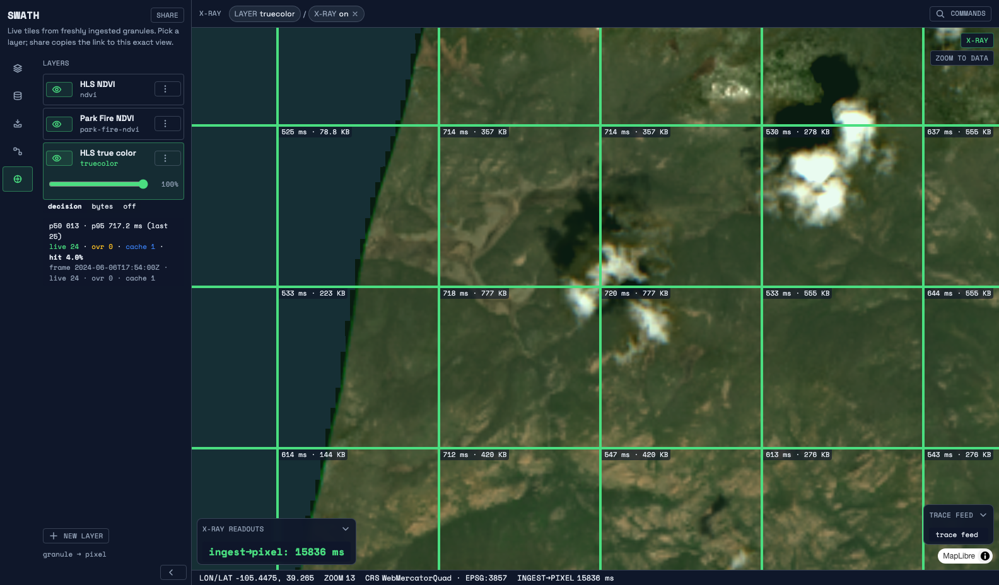
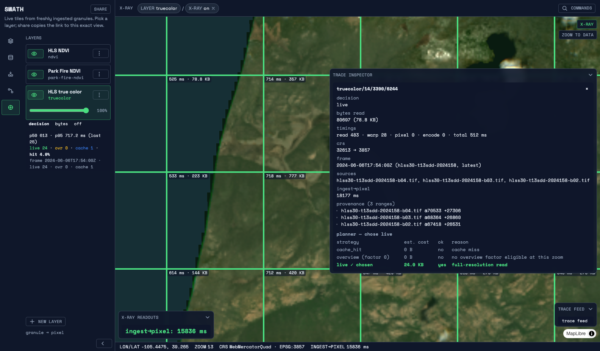
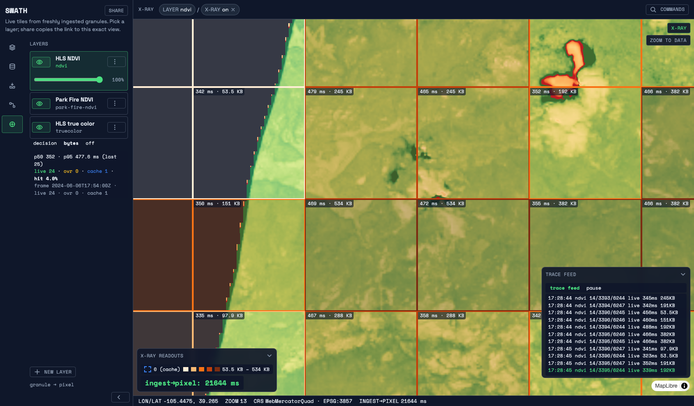
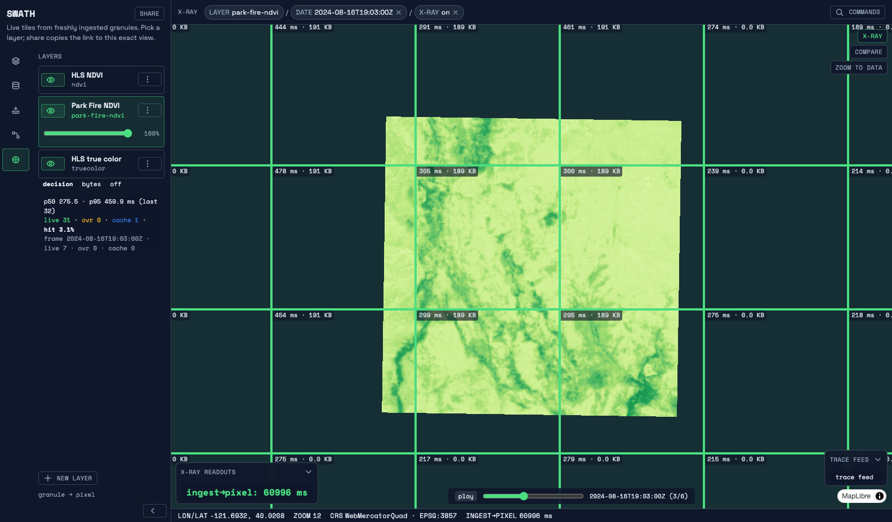
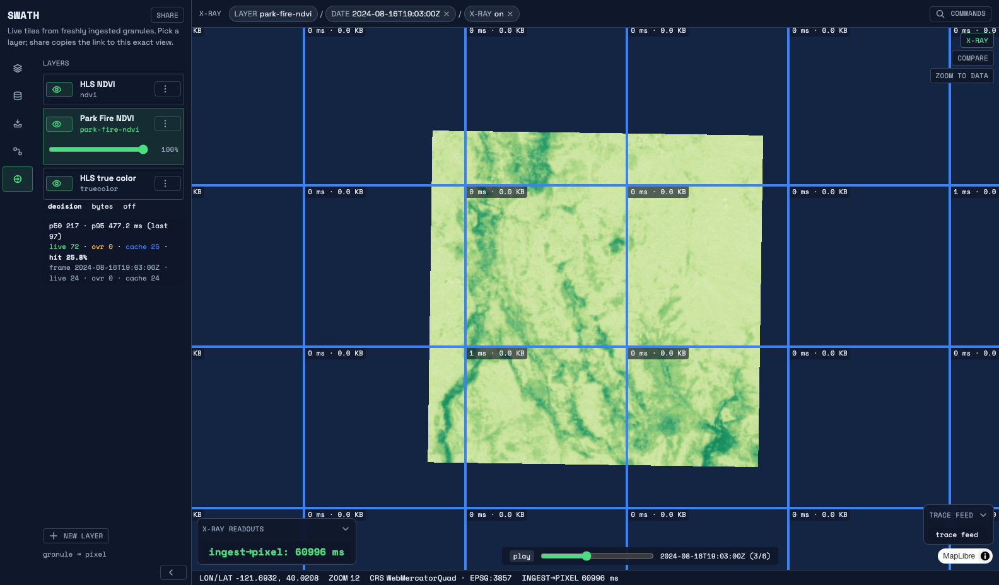
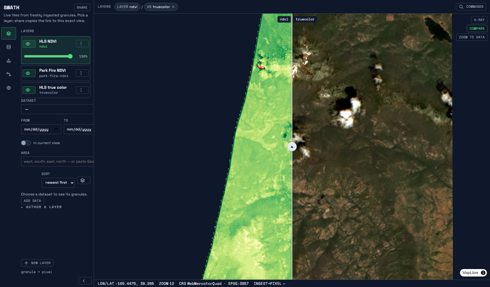

# The stopwatch demo — ingest-to-pixel, live

The stopwatch demo: watch a granule go from *"file arrives"* to *"correct pixels on the
map"* with zero manual steps, and put a number on it — **ingest-to-pixel latency**
(REQUIREMENTS.md §3; why this demo exists: CHARTER.md §10).

## What you'll see

**Scale expectations first:** the demo granule is a deliberately tiny CI-sized fixture — a
**512×512-pixel (≈15×15 km) subset** of one HLS scene — so the demo (and CI, forever) runs in
seconds from a clean checkout; the platform serves real-size granules the same way.

The full local stack (Swath in catalog mode + pgstac + MinIO) comes up with one command. The
viewer opens over the granule's footprint, **empty on purpose** — the layer exists, its pixels
don't yet, and a tile of the empty catalog is an honest 404. A countdown ends, the granule
drops (five band COGs, manifest renamed last), ingest → catalog → serve happens untouched, and
the measured ingest-to-pixel number prints big at the end. Switch to **HLS NDVI**:
`(B8A − B04)/(B8A + B04)` is computed **on the fly** at request time — nothing is pre-baked,
and the x-ray proves it.

## Run it

```sh
just setup-web   # once: web deps
just demo        # bring-up, countdown, drop, number; ctrl-c tears down
```

The recipe prints the URL to open while the stack builds; pre-drop tiles 404 (honestly empty)
and the component auto-retries, so imagery appears on its own moments after ingest.

## What the x-ray overlay is telling you

The overlay (on by default via `?xray`) is the glass box (REQUIREMENTS.md R4): it subscribes
to `/traces` and paints, per tile, the server's own account of the render — the **decision**,
and on click an inspector with sources, byte ranges, CRS hop, and stage timings; the top-left
readout shows the latest **ingest→pixel** number. Every fact comes from the same `Trace` the
e2e asserts on. Three display modes — **decision**, **bytes** (a log-scale heatmap),
**off** — plus the inspector's **why-view** (every candidate the planner weighed) and a
bounded, pausable **trace feed** drawer.







## Watch a fire season evolve

The time dimension, live. The demo stack also ingests the **six-date 2024
Park Fire series** (`tests/fixtures/README.md`), so the same session can scrub a real fire
season:

1. Switch to **Park Fire NDVI**. The map **auto-frames the layer's data**, and a **time
   slider** appears — its stops are the six acquisition dates, read straight from
   `GET /datasets/hls-s30-fire/granules` (a single-date layer shows no slider).
2. Scrub oldest → newest with the x-ray on: every frame is one `datetime=` request resolved
   latest-at-or-before — the server's rule, not the client's guess — and the vegetation index
   collapses as the burn scar appears.
3. The glass-box moment: on the **first pass** every badge says `live`; scrub **again** and
   every badge flips to `cache_hit` — frames cache under the granule they resolved to; a
   badge's inspector names the frame (granule id, datetime, rule).
4. **Play** prefetches the next frame's tiles, so a seen season animates without a stutter;
   scrubbing writes `t=<instant>` into the share link, which alone reproduces the exact frame
   anywhere.

The regression guarantee extends here: `just e2e` asserts `datetime=` frame selection against
committed oracle goldens, and the Playwright suite (`web/e2e/time-slider.e2e.ts`) drives this
exact scrub-twice loop through the same trace stream.





The compare swipe puts two frames of the season — or two layers — under one draggable handle
(`?t=…&ct=…`, or `?layer=…&cl=…`; the handle's position rides in the share link):



Frame identity rules (which granule a `datetime=` selects, why a revisited frame is a cache
hit): ADR 0015.


## Current measured numbers

| Where                  | ingest-to-pixel | Notes                                                            |
| ---------------------- | --------------- | ---------------------------------------------------------------- |
| **Committed baseline** | **<!-- number:i2p-ms -->646 ms<!-- /number:i2p-ms -->** | `just perf-i2p`, stamped at <!-- number:i2p-sha -->`27deca2`<!-- /number:i2p-sha --> — [`docs/perf/i2p-baseline.json`](perf/i2p-baseline.json), method in [`PERFORMANCE.md`](PERFORMANCE.md) §4 |
| **Asserted budget**    | **10 000 ms**   | ~15x headroom over the committed baseline                        |

## The regression guarantee

This demo cannot rot: `just e2e` (CI on every PR and push) drives the **same path** — same
stack bring-up, granule drop, and tile URLs — and asserts it forever: the pre-drop tile is an
honest 404; the truecolor **and NDVI** tiles perceptually match their committed oracle goldens;
the NDVI trace carries `decision: "live"`; and `ingest_to_pixel_ms` is asserted under the
**10 000 ms** budget — the permanent north-star guard, tightened only as a deliberate, visible
act.
