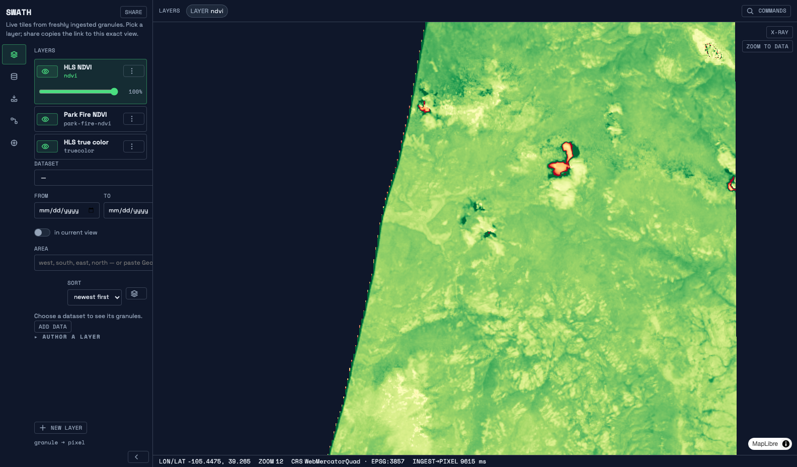
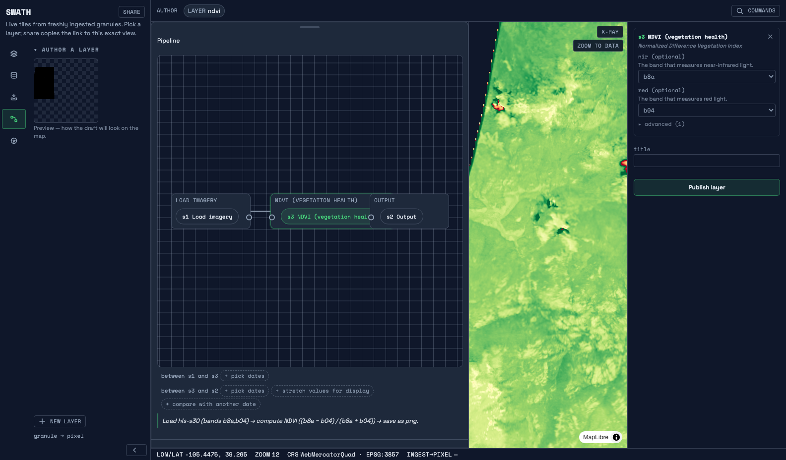
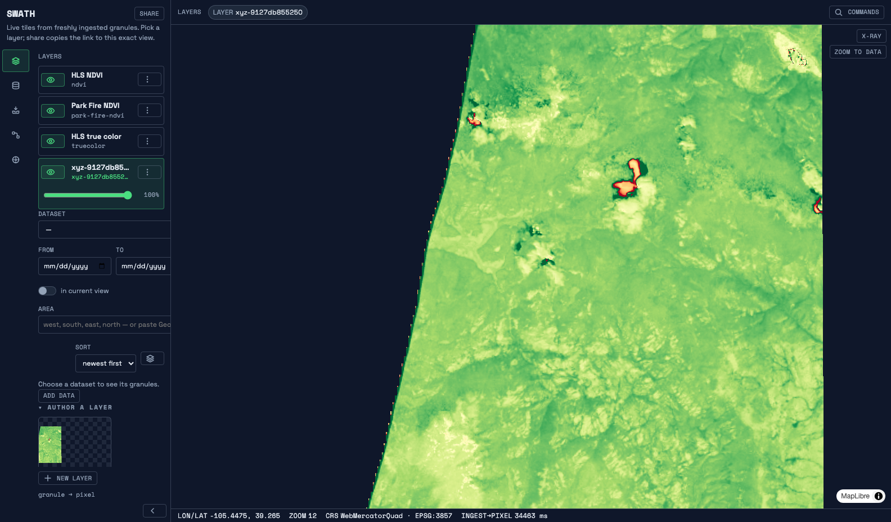

# Quickstart

From nothing to live satellite tiles, three ways — each track executed
verbatim in a fresh environment; the Track 1 one-liner is smoke-tested by CI
before every image publish.

| Track | You get | You need |
|---|---|---|
| [1. Tiles in your browser](#track-1--tiles-in-your-browser-one-command) | The demo layers and the viewer, one command | Docker |
| [2. Author your first layer](#track-2--author-your-first-layer) | Your own NDVI variant, published from the UI and live on the map | The Track 3 stack |
| [3. The full demo from a checkout](#track-3--the-full-demo-from-a-checkout) | The complete ingest → catalog → serve motion, with the measured ingest-to-pixel number | Docker, `git`, `just`, Node + `pnpm` |

Going deeper: [`DEMO.md`](DEMO.md) (the x-ray tour),
[`OPERATIONS.md`](OPERATIONS.md), [`CONFIG.md`](CONFIG.md),
[`ENDPOINTS.md`](ENDPOINTS.md).

## Track 1 — tiles in your browser (one command)

Runs the published image with the committed HLS fixtures baked in: HLS true
color and on-the-fly NDVI plus the embedded viewer, zero config, zero
checkout.

```sh
docker run -p 8080:8080 ghcr.io/forgo/swath serve --fixtures
```

The first run pulls the image (~120 MB).



Open <http://localhost:8080> — the
viewer, with the fixture granule (a 512×512-pixel HLS subset over the Rockies)
fitted in view; NDVI is computed live from the band COGs on every uncached
tile request. (A catalog with a time series — the checkout stack's Park Fire
season — opens on that loop instead, with a Share button for the exact view:
[`media/screenshots/01-landing-layer-rail.png`](media/screenshots/01-landing-layer-rail.png).)
Prefer proof over pixels? `/healthz` answers `ok`,
`/tilesets/ndvi/tiles/12/1561/848` answers `200 image/png`. `ctrl-c` stops
the container; every route is in [`ENDPOINTS.md`](ENDPOINTS.md).

## Track 2 — author your first layer

The authoring loop: compose an openEO graph in the UI, publish it, and watch
it serve as a live tile layer — same compiler and serve path as the built-in
layers (the design: [ADR 0010](decisions/0010-openeo-authoring-surface.md)).

**Prerequisite:** the full catalog-mode stack (Track 1 serves a fixed layer
set only), so run Track 3's commands first, then in the viewer: **Author a
layer** (the palette and every form field are generated from the server's own
`GET /processes` — nothing is hard-coded in the UI) → **Start from the NDVI
template** (a working four-step pipeline prefilled from server metadata, with
a plain-words narrative line) → change the colormap to `viridis` and title it
→ **Publish** (enabled only while the graph is structurally valid) — the new
layer appears in the rail immediately, no reload.




The published service survives restarts and can be deleted from the
**Published** list — after which its tile URL honestly 404s.

### The same thing over curl

The panel is a pure client of the openEO API; the walkthrough above is one
`POST /services` with a four-node graph
(`load_collection → ndvi → linear_scale_range → save_result` with
`options.colormap: "viridis"` — the scale step is needed because the render
path quantizes to 8-bit and rejects any output range other than `0..255`; the
UI's smart defaults do this for you). Body shape and headers:
[`ENDPOINTS.md`](ENDPOINTS.md) `POST /services`; a full graph of exactly this
shape is exercised by
[`crates/swath-api/tests/openeo_services.rs`](../crates/swath-api/tests/openeo_services.rs).
The server assigns the id (the `OpenEO-Identifier` header), and the service
serves on the next tile request: `GET /tilesets/<id>/tiles/12/1561/848`
answers `200 image/png`.

## Track 3 — the full demo from a checkout

The stopwatch demo: the full local stack comes up, a granule drops, and
ingest → catalog → serve happens with zero manual steps, timed. What you will
see, and what the x-ray is telling you, is [`DEMO.md`](DEMO.md). You need
Docker (with compose), `git`, [`just`](https://just.systems), Node.js and
`pnpm`; no Rust toolchain — the server builds inside Docker.

```sh
git clone https://github.com/forgo/swath.git
cd swath
just setup-web   # once: web deps + the Playwright chromium
just demo
```

The first run builds the image (several minutes; later runs start in
seconds); open the printed viewer URL while it builds. `ctrl-c` tears the
stack down.


## Troubleshooting

- **Docker isn't running**: start Docker Desktop or `systemctl start docker`
  and rerun.
- **Port already in use.** Track 1 and the stack both bind 8080 (the stack
  also takes 5173, 5432, 9000); `just demo` refuses loudly when it detects a
  previous demo or stack. Fixes: `ctrl-c` the previous demo;
  `docker compose down -v`; `docker stop <name>` for a Track 1 container;
  `lsof -ti :8080` for anything else.
- **The map is still gray after the countdown**: nudge the map (drag or zoom)
  to force fresh requests once the auto-retry has stopped.
