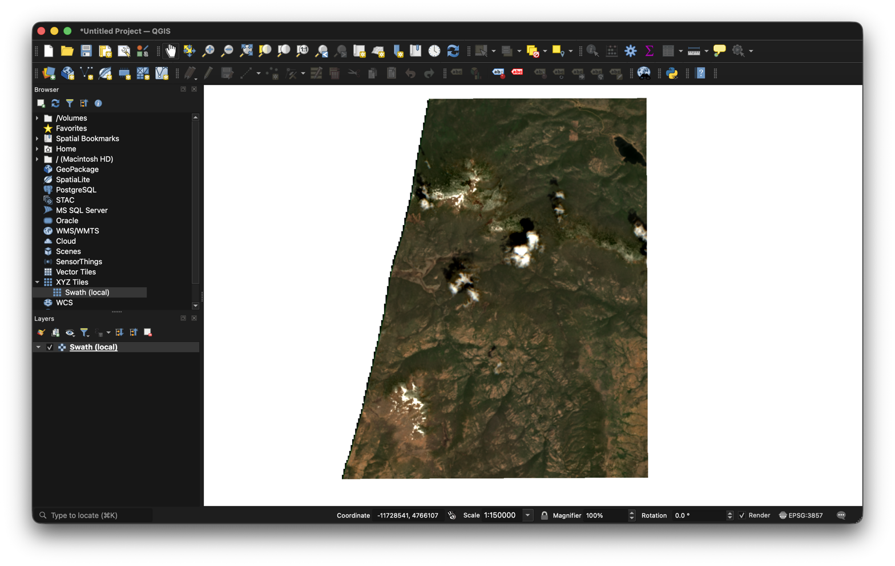

# Recipes — Swath in the tools you already use

Meet-them-where-they-are bridges: no plugin, no SDK, no migration. Each
recipe is smoke-tested in CI against the compose stack (`swath-e2e`'s
`qgis_xyz_template_serves_png`), so a documented URL that stops working
fails the build.

## QGIS — XYZ Tiles connection (zero code)

Swath's tile route is already XYZ-shaped
(`GET /tilesets/{layerId}/tiles/{tileMatrix}/{tileRow}/{tileCol}`,
ENDPOINTS.md), so QGIS consumes it as a stock **XYZ Tiles** layer:

1. Start a stack (`just demo`, or `swath serve` — QUICKSTART.md).
2. In QGIS: *Browser panel → XYZ Tiles → right-click → New Connection…*
3. Name it, and set the URL template (tile row is `{y}` — placeholders
   substitute wherever they appear, so OGC `z/row/col` order just works):

   ```text
   http://localhost:8080/tilesets/truecolor/tiles/{z}/{y}/{x}
   ```

4. Set *Min/Max zoom* to the layer's tile matrix range (the fixture
   layers serve z9–z13), then drag the connection onto the canvas.

Any layer id from `GET /tilesets` works in place of `truecolor`
(`ndvi` computes on the fly — nothing pre-baked).

**Dated layers** (the time dimension, ADR 0015): pin a frame by adding
`datetime=` to the template — QGIS passes the query string through
unchanged:

```text
http://localhost:8080/tilesets/park-fire-ndvi/tiles/{z}/{y}/{x}?datetime=2024-08-01T00:00:00Z
```

Absent `datetime`, tiles follow the newest ingested granule — a live
QGIS canvas updates as granules arrive (refresh the layer). The
granules a layer can pin are listed by `GET /tilesets/{layerId}/granules`.

Remote stacks: substitute the host; nothing else changes.

Evidence (hand-captured — the reproducible suite cannot drive a desktop app):



## ArcGIS — parked

Deliberately not written until the QGIS recipe proves the
meet-them-where-they-are pattern with real users: ArcGIS Pro consumes
XYZ the same way (*Add Data → Data From Path → Tile Layer*), but a
recipe we haven't exercised is a support liability, not a bridge.
Revisit on the first real request.

## Jupyter — the standard openEO Python client (no bespoke SDK)

The stock [`openeo`](https://pypi.org/project/openeo/) client drives
Swath's bounded profile (ADR 0010/0014); a Swath-specific SDK or widget
is a recorded anti-goal. The notebook loop, verbatim
(`pip install openeo`):

```python
import openeo
from openeo.rest.datacube import THIS
conn = openeo.connect("http://localhost:8080")
conn.list_collection_ids()                       # ['hls-s30', …]
cube = conn.load_collection("hls-s30", bands=["b04", "b8a"])
cube = cube.ndvi(nir="b8a", red="b04")
cube = cube.process("linear_scale_range", x=THIS,  # not .linear_scale_range():
                    inputMin=-1, inputMax=1,       # the sugar emits `apply`,
                    outputMin=0, outputMax=255)    # outside the subset
cube = cube.save_result(format="png")
png = cube.download()                            # POST /result
from IPython.display import Image; Image(png)    # inline preview
```

Profile narrowings the client will surface honestly:

- **No `apply`:** the client's `.linear_scale_range()` convenience wraps
  its process in `apply`, which the subset excludes — use the explicit
  `.process()` form above (finding recorded for ADR 0010's reopen list).
- **Band names are the collection's declared values** (`b04`, `b8a`, …
  from `cube:dimensions`) and `ndvi` takes explicit `nir=`/`red=`
  targets — no common-name alias vocabulary is persisted.
- **`POST /result` is the bounded preview** (ADR 0014): one small
  overview-backed PNG of the graph's extent; over-budget requests are
  refused with `ProcessGraphComplexity`, and PNG is the only output
  format (`GET /file_formats`).
- Publishing a graph as a live tile layer is
  `conn.create_service(cube, type="xyz")` — the returned service id is a
  `/tilesets/{id}` layer, QGIS-consumable per the recipe above.

CI runs this exact loop with the pinned client on every stack change
(`tests/openeo/client_check.py`, wired into `just e2e`).
