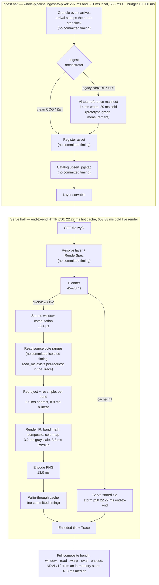

# Ingest-to-pixel flow, with measured stage timings

Every number below comes from a committed artifact — see
[`ingest-to-pixel-flow.notes.md`](ingest-to-pixel-flow.notes.md) for the figure-by-figure
provenance (bench medians are criterion medians on Apple M2 Max; HTTP percentiles are the
committed load baseline; whole-pipeline numbers are the e2e harness). Stages labeled
*no committed timing* have never been measured in a committed artifact and carry no number
on purpose.

Reading notes:

- The stage benches deliberately do **not** sum to the 37.3 ms composite: the composite reads
  two bands concurrently from an in-memory store and includes trace assembly, while the warp
  bench measures a single band.
- The hot-cache and cold-live figures are end-to-end HTTP percentiles under concurrency
  (oha storms), not single-request stage sums.
- The ingest-half total (297/801/535 ms) has no committed per-stage breakdown; only the total
  is measured, and up to ~500 ms of it is e2e poll granularity.
