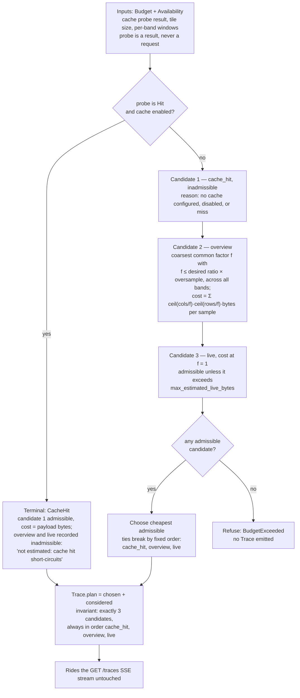

# Planner decision loop, with a real `plan.considered`

The loop below is `plan()` in `crates/swath-core/src/planner.rs` — pure, deterministic, no
I/O. The payload on the right of the diagram is a **real capture, not a mock**: it is copied
verbatim (abridged to the `plan` field) from
[`planner-trace.capture.json`](planner-trace.capture.json), the committed `GET /traces` SSE
frames recorded from the fixture stack. Provenance in
[`planner-decision-loop.notes.md`](planner-decision-loop.notes.md).



## The captured payload (abridged)

Tile `11/424/780`, layer `truecolor`, fixture stack (`swath serve --fixtures`, no cache
configured — hence candidate 1's reason). From `planner-trace.capture.json`, `events[0]`:

```json
{
  "chosen": { "overview": { "factor": 2 } },
  "considered": [
    {
      "strategy": "cache_hit",
      "estimated_cost_bytes": 0,
      "admissible": false,
      "reason": "no cache configured"
    },
    {
      "strategy": { "overview": { "factor": 2 } },
      "estimated_cost_bytes": 385572,
      "admissible": true,
      "reason": "coarsest overview within the oversample threshold"
    },
    {
      "strategy": "live",
      "estimated_cost_bytes": 1542288,
      "admissible": true,
      "reason": "full-resolution read"
    }
  ]
}
```

Both admissible candidates were costed; the overview won on price (385 572 < 1 542 288 bytes,
three bands at factor 2 versus full resolution), and the executed decision in the same trace is
`{"overview": {"level": 2}}`. The capture's second event (`events[1]`, z12 NDVI) shows the
other common outcome: no eligible overview factor at that zoom, so `chosen` is `"live"`.
