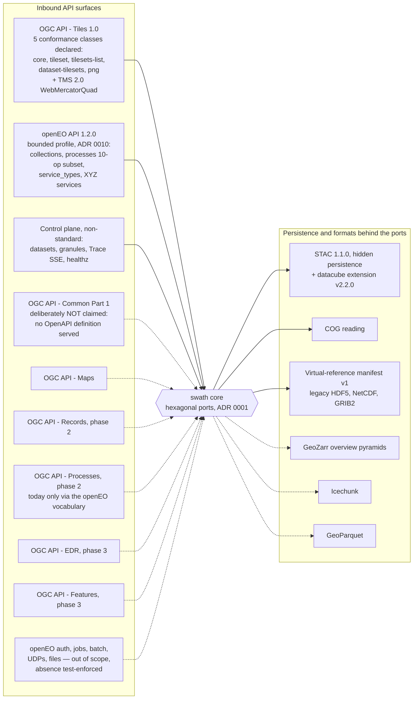

# Standards surfaces map

Solid lines are surfaces that exist in code with conformance-grade test evidence; dashed lines
are deferred, deliberately-not-claimed, or docs-only surfaces. The split is cross-checked
line-by-line against the declared conformance list and the test files in
[`standards-map.notes.md`](standards-map.notes.md).

Honesty notes the map encodes (details and evidence in the sidecar):

- `/conformance` declares **exactly** the five OGC Tiles classes and nothing else; a test pins
  the declared set to the constant and a negative test forbids claiming OGC API - Common.
- openEO is implemented as a bounded profile validated against the pinned official 1.2.0
  schemas, but **no openEO conformance class URI is claimed** — by design (no auth endpoints).
- OGC API - Maps is paired with Tiles in ARCHITECTURE.md's phase table but has no endpoints,
  classes, or tests — it is dashed here (doc over-claim; only a `tilesets-map` link rel exists).
- STAC is deliberately hidden (R2): validated by round-trip property tests and snapshots, not
  by external schemas — solid as a persistence contract, not as an inbound surface.
